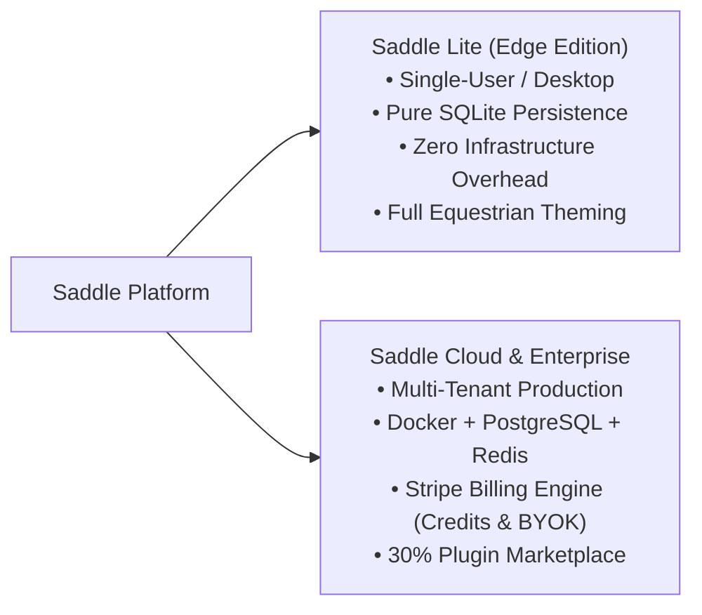
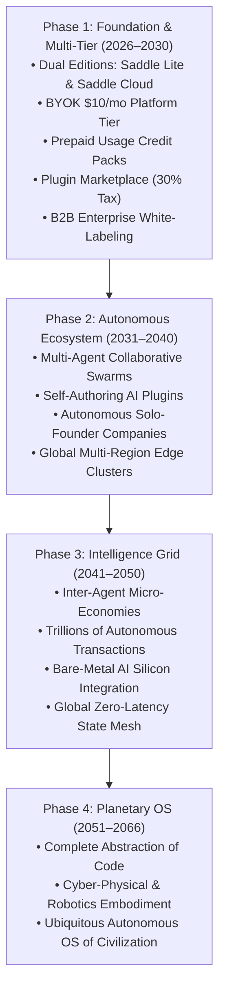

# Saddle Platform: The 40-Year Master Plan (2026 - 2066)

> *"Trade your harness for a saddle."*

> [!TIP]
> **Active Sprint Roadmap:** For the fast-tracked sprint breakdown, authentication architecture, per-user plugin isolation, and immediate engineering priorities, see the [Saddle Master Execution Plan](file:///Users/brightonm1/.gemini/antigravity/brain/97db5a70-1029-431f-b253-1745424bc8ff/saddle_master_execution_plan.md).

Saddle is a paradigm shift from rigid AI harnesses to an adaptive, multi-tenant digital operating system. Rather than restricting AI into static tool wrappers, Saddle provides a dynamic interface to steer autonomous intelligence across individual developers, consumer power-users, and global enterprises.

---

## The Dual-Edition Product Strategy

Saddle is delivered in two purpose-built editions:

1. **Saddle Lite (Local & Edge Edition):**
   * Lightweight, zero-dependency, single-user runtime backed by local SQLite.
   * Preserves all custom Saddle cosmetic themes (Palomino, Friesian, Chestnut) and client tools.
   * Ideal for local desktop development, offline/air-gapped workstations, and simple personal $4/mo VPS setups.

2. **Saddle Cloud (Enterprise Multi-Tenant Edition):**
   * Multi-tenant, high-availability architecture running on isolated Docker containers with PostgreSQL and Redis.
   * Complete commercial engine: Stripe-powered Credit Packs (3x–5x markup), $10/mo BYOK platform tier, and 30% Plugin Marketplace tax.

---

## Active Commercial Tiers (Active from Day 1)

| Tier | Target Audience | Pricing & Monetization Model | Protection & Margins |
| :--- | :--- | :--- | :--- |
| **1. Saddle Lite** | Open-Source Hackers & Devs | Free / Self-Hosted. Local SQLite storage. | 0 infrastructure cost to platform. Powers top-of-funnel adoption. |
| **2. Usage Credits** | Regular Consumers & Power Users | Prepaid Saddle Credit Packs ($10 for 1,000 credits). 1 credit per chat, 50 credits per background agent. | **3x–5x markup** on raw LLM/compute. Zero risk of runaway user costs. |
| **3. BYOK Tier** | Developers & Power Users | **$10/month Platform Access Fee**. User brings their own API key (DeepSeek, OpenAI, Anthropic, Gemini). | **Pure margin** on inference. Capped via Redis (max 2 concurrent jobs) and Postgres (1GB storage limit) to prevent server abuse. |
| **4. Plugin Marketplace** | Creators, Devs, & Users | Buy/Sell specialized dynamic Cordis plugins (SEO agents, Bloomberg UI visualizers, trading bots). | **30% Platform Tax** on all creator transactions (App Store economics without Apple's cut). |
| **5. Enterprise White-Label** | B2B & Organizations | **$2,000 – $5,000/month** per dedicated isolated Docker cluster with SSO, team workspaces, and custom themes. | High-ticket recurring revenue; guaranteed baseline MRR. |

---

## 40-Year Evolution Roadmap

---

### Phase 1: Foundation & Monetization (Years 1 – 5: 2026–2030)

#### Where We Are Right Now (Year 0 / Day 1 Live Status)
* ✅ **Hetzner Production Cluster Online:** Dockerized multi-container runtime (`saddle-app`, `postgres`, `redis`) up and healthy on Hetzner VPS (`91.99.165.95`).
* ✅ **Clean Slate Host:** VPS host filesystem cleared of prototype residue; dedicated 100% to production containers.
* ✅ **API Gateway & Security Fence:** Resolved DNS-rebinding security policies (`HTTP 200 OK` across all model providers and tools).
* ✅ **Saddle Lite Desktop Archive:** Pure SQLite standalone edition safely archived on desktop for personal use and friends.
* 🔄 **Current In-Progress Milestone:** UI complete rebrand (stripping upstream Harness remnants) + Stripe Billing Engine integration.

#### Phase 1 Target Milestones
* **Self-Serve Consumer & Prosumer Onboarding:** Instant web sign-up via Stripe checkout for Credit Packs and the $10/mo BYOK tier.
* **Plugin Marketplace V1:** Launching curated Cordis extensions where developers sell agent tools with a 30% platform fee.
* **24/7 Persistent Autonomous Background Agents:** Long-running background agent execution for research, coding, trading, and workflow automation.
* **First 10,000 Active Users:** Mix of 9,500 consumer/BYOK users and 50 early enterprise white-label instances.

---

### Phase 2: The Self-Sustaining Ecosystem (Years 6 – 15: 2031–2040)
**The Shift from Tool to Digital Workforce**
* **Target Audience:** Mass-market consumers, remote workers, automated startups, and mid-market companies.
* **Milestones:**
  * **Autonomous Agent Swarms:** Users deploy teams of specialized agents (frontend, backend, QA, marketing) that collaborate in real time.
  * **Self-Authoring Plugins:** Saddle agents write, test, and publish their own plugins to the marketplace, creating an exponential library of capabilities.
  * **Agent Organizations:** Solo founders running $10M+ businesses with zero human employees, orchestrating operations entirely from their Saddle dashboard.
  * **Decentralized Multi-Region Infrastructure:** Global Kubernetes clusters routing user tasks to the nearest edge data center.

---

### Phase 3: The Global Intelligence Grid (Years 16 – 25: 2041–2050)
**Planetary Scale Interoperability**
* **Target Audience:** Global digital economy, international financial institutions, decentralized autonomous organizations (DAOs).
* **Milestones:**
  * **Inter-Agent Micro-Economy:** Trillions of autonomous transactions per day as agents negotiate compute, proprietary datasets, and task completion using Saddle Credit rails.
  * **Hardware Abstraction:** Saddle OS runs directly on bare-metal AI silicon, bypassing legacy OS kernels to deliver ultra-low-latency agent collaboration.
  * **Zero-Latency Global State:** Geo-distributed database mesh keeping millions of autonomous processes perfectly synchronized across continents.

---

### Phase 4: The Paradigm Shift (Years 26 – 40: 2051–2066)
**The Operating System of Civilization**
* **Target Audience:** Universal.
* **Milestones:**
  * **End of Traditional Programming:** Software syntax is obsolete. Humans express goals and intent through Saddle; intelligence swarms construct, run, and tear down ephemeral systems dynamically.
  * **Cyber-Physical Embodiment:** Saddle expands beyond digital servers to power robotics, autonomous logistics, and industrial automation under the same billing and permission fabric.
  * **Ubiquitous Substrate:** Saddle becomes the foundational OS of the AI century—the saddle upon which humanity rides the frontier of intelligence.
