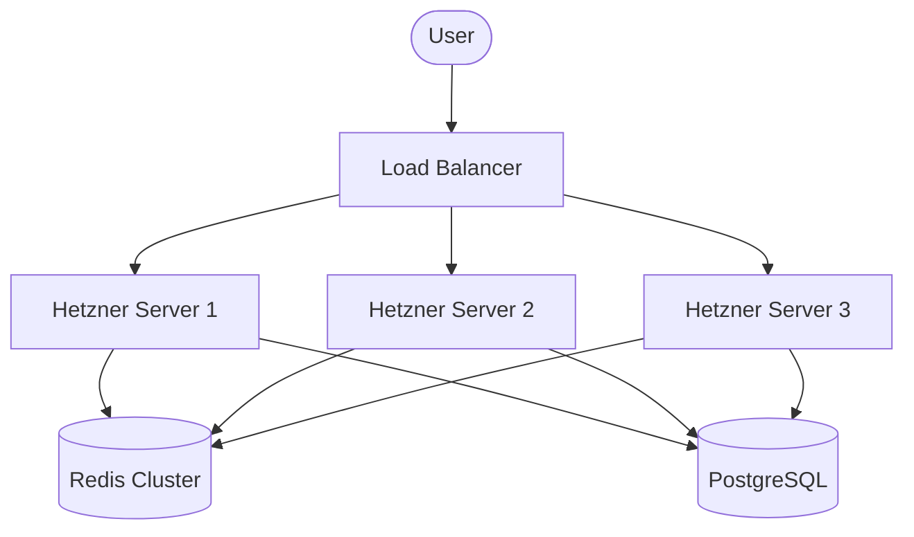

# From One User to a Billion: The DeepSeek Harness Scaling Plan

The architectural decisions made today—choosing the highly modular Cordis framework, decoupling the frontend from the AI logic, and unlocking the API for remote access—are the absolute bedrock of a planetary-scale application.

Because Cordis treats every component as a hot-swappable plugin, scaling this harness doesn't require throwing away code and starting from scratch. Instead, you swap plugins (e.g., swapping `session-persistence-sqlite` for `session-persistence-postgres`) as you grow.

Here is the engineering roadmap to take this harness from your single Hetzner VPS to the scale of Facebook, Instagram, or ChatGPT.

---

## Phase 1: The Foundation (1 to 1,000 Users)
**Current State**

You are currently in Phase 1. The goal here is rapid prototyping, finding product-market fit, and establishing the core feature set.

* **Compute:** A single Hetzner VPS.
* **Process Management:** PM2 running a single Node.js instance.
* **Database:** Local SQLite file (`session-persistence-sqlite`).
* **State:** WebSockets and user sessions are stored in the memory of the single VPS.
* **Bottleneck:** The VPS will run out of RAM holding open WebSocket connections, or the SQLite database will lock up during heavy concurrent writes.

> [!TIP]
> **Actionable Next Step:** Build the `auth-plugin` and `billing-plugin` using Cordis to lock down the platform and start accepting payments.

---

## Phase 2: The Distributed SaaS (1,000 to 100,000 Users)
**The Revenue Stage**

When you have thousands of active users, a single server is no longer safe. If the server crashes, your entire business goes offline. You must introduce **Horizontal Scaling**.

* **Compute:** 3 to 5 Hetzner Dedicated Servers.
* **Load Balancing:** NGINX or AWS Application Load Balancer (ALB) sitting in front of your servers, distributing incoming traffic evenly.
* **Database:** Managed PostgreSQL. You will write a new Cordis plugin (`session-persistence-postgres`) so all servers read and write from a central, reliable database.
* **State Management:** **Redis.** Because User A might connect to Server 1, and the AI response might be processed on Server 2, you need a central message broker. A Redis plugin will handle Pub/Sub so WebSocket events sync seamlessly across all servers.

---

## Phase 3: High Availability (100,000 to 10 Million Users)
**The Enterprise Stage**

At millions of users, hardware failures are no longer a possibility; they are a daily certainty. You must decouple the heavy AI reasoning from the lightweight Web UI.

* **Compute:** Kubernetes (K8s) Clusters. Servers automatically spin up when traffic spikes (e.g., daytime) and spin down when traffic drops.
* **Decoupled Architecture:**
  * *API Nodes:* Thousands of tiny instances just holding WebSocket connections open for users.
  * *Worker Nodes:* Heavy CPU instances dedicated purely to executing the DeepSeek Harness Python tools, bash commands, and routing LLM requests.
* **Event Streaming:** Apache Kafka replaces Redis for event streaming. Every user prompt, tool execution, and AI thought is an event logged to Kafka, ensuring zero data loss even if a whole datacenter loses power.
* **Global Edge CDN:** Cloudflare caches the frontend web app at the edge so it loads instantly anywhere in the world.

> [!IMPORTANT]
> **The Cordis Advantage:** You won't have to rewrite the app to decouple it! You will simply launch the API Nodes with the `web-server` plugin, and the Worker Nodes with the `agent` plugin. Cordis handles the rest.

---

## Phase 4: Planetary Scale (10 Million to 1 Billion Users)
**The ChatGPT / Meta Stage**

At a billion users, you are bound by the laws of physics (the speed of light) and the limitations of traditional software engineering.

* **Multi-Region Deployments:** You operate massive data centers in North America, Europe, and Asia. A user in Tokyo connects to the Tokyo cluster; a user in London connects to the London cluster.
* **Globally Distributed Databases:** Standard PostgreSQL cannot handle a billion users. You migrate to a highly sharded, geographically distributed database like **Google Spanner** or **CockroachDB**, where data is replicated globally with atomic clocks ensuring consistency.
* **Custom Infrastructure:**
  * You no longer use standard Linux TCP networking; you write custom networking stacks (e.g., eBPF, DPDK) to bypass the OS kernel and handle millions of packets per second.
  * You utilize massive Dark Fiber rings connecting your data centers directly.
* **Extreme Statelessness:** User sessions are highly ephemeral. The AI models are fine-tuned to your specific platform, and inferences are run on specialized internal GPU clusters (like Google TPUs or custom ASICs) rather than public APIs.

> [!CAUTION]
> At this scale, even a 1% inefficiency in code costs millions of dollars in electricity and hardware. Entire teams of engineers are hired simply to shave milliseconds off of database queries.
