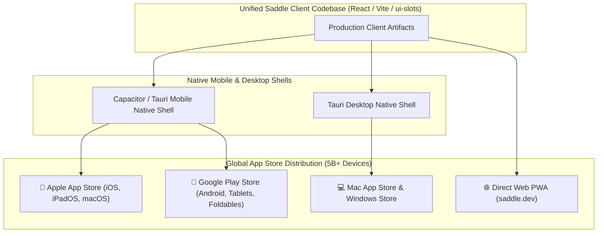

# Saddle App Store Launch & Native Mobile Strategy: The Global Distribution Blueprint

> *"Trade your harness for a saddle."*

---

## 1. Executive Answer: YES, Absolutely.

**Saddle is primed for rapid packaging and global deployment across the Apple App Store (iOS, iPadOS, macOS) and the Google Play Store (Android).**

Because Saddle's client architecture is built on standard, ultra-fast **React, Vite, CSS Modules, and TypeScript**, the entire responsive interface can be wrapped into native mobile applications using **Capacitor** or **Tauri Mobile** without rewriting a single line of UI logic.

---

## 2. Technical Packaging Architecture: Zero Frontend Rewrite

### Option A: Capacitor Native Bridge (Recommended for Fast-Track Mobile Launch)
* **What it is:** The modern enterprise standard for cross-platform native apps (used by Southwest Airlines, Burger King, and major fintech apps).
* **How it works:**
  1. Runs our optimized Vite build inside a high-performance native **WKWebView (iOS)** and **Android System WebView**.
  2. Provides typed native bridges to hardware APIs:
     * **Biometric Auth:** FaceID / TouchID / Android Fingerprint login.
     * **Native Push Notifications:** Real-time alerts when background agents finish long-running tasks.
     * **Native Haptic Engine:** Tactile feedback on button presses and agent tool executions.
     * **Background Audio & Microphone:** Real-time voice conversation mode with Saddle agents.
     * **Embedded Offline SQLite:** For **Saddle Lite on Mobile**, the entire database runs locally on the phone.

### Option B: Tauri Mobile (Rust-Powered Native Shell)
* **What it is:** Ultra-lightweight Rust wrapper yielding tiny binary sizes (< 15MB) and blazing fast memory performance.

---

## 3. Apple & Google App Store Policy Compliance Strategy

Navigating Apple's App Store Review Guidelines (and Google Play policies) requires a clear strategic playbook:

### 1. In-App Purchases (IAP) vs. The "Reader / Multiplatform" Rule
* **The Apple Tax (Guideline 3.1.1):** Digital goods purchased directly inside the iOS app incur a 15% (Small Business Program) or 30% Apple fee.
* **The Saddle Hybrid Monetization Playbook (Guideline 3.1.3(b) Multiplatform Services):**
  * **On iOS/Android:** Users can buy "Saddle Credit Packs" via Apple In-App Purchase / Google Play Billing for maximum mobile conversion.
  * **On the Web (`saddle.dev`):** Users can subscribe to the $10/mo BYOK tier or enterprise clusters via Stripe with **0% Apple tax**.
  * Under Apple's Multiplatform rule (identical to ChatGPT, Spotify, and Netflix), any user who subscribed or purchased credits on the web can log in and use their full account on the iPhone app without restrictions.

### 2. Dynamic Plugin Loading (Guideline 2.5.2 Compliance)
* **Apple Rule:** Apps cannot download and execute arbitrary binary code that alters core functionality.
* **Why Saddle is 100% Compliant:**
  * Saddle plugins are interpreted JavaScript/CSS running inside the standard WebKit JavaScript engine within the app's sandbox—the exact same compliant model used by **Figma, Notion, Slack, and Discord**.
  * No compiled native machine binaries are downloaded.

### 3. AI Safety & Moderation (Guideline 1.2)
* We provide standard EULA / Terms of Service.
* Every AI response has a built-in "Report / Flag" button in `chat.message.actions`.
* Guardrails in our policy layer prevent toxic or illegal content generation.

---

## 4. Why an App Store Launch Accelerates Saddle to 1 Billion Users

1. **Instant Trust & Discovery:** Millions of consumers discover apps by searching the iOS App Store for *"AI Assistant"*, *"Autonomous Agent"*, or *"Productivity OS"*.
2. **Permanent Home Screen Real Estate:** Mobile users open apps on their home screen 10x more frequently than typing URLs into mobile Safari.
3. **Native Voice & Siri Shortcuts Integration:** Users can say *"Hey Siri, ask Saddle to analyze this contract"*, triggering background agent swarms instantly.
4. **Push Notification Retention Loop:** When an autonomous research agent completes a 3-hour deep dive at 2:00 AM, a native push notification wakes the user with the summary.

---

## 5. Mobile App Store Launch Checklist (Sprint 4–5 Roadmap)

- [ ] Initialize `@capacitor/core`, `@capacitor/ios`, and `@capacitor/android` in monorepo.
- [ ] Configure Apple Developer Program ($99/yr) & Google Play Console ($25 one-time) under Delaware C-Corp.
- [ ] Generate mobile App Store icons (1024x1024) featuring official Saddle equestrian branding.
- [ ] Connect Apple In-App Purchase and Google Play Billing webhooks to Stripe backend.
- [ ] Test Safe Area insets and Dynamic Island clearance on physical iPhone 16 Pro hardware.
- [ ] Submit for TestFlight beta testing and public App Store review.
