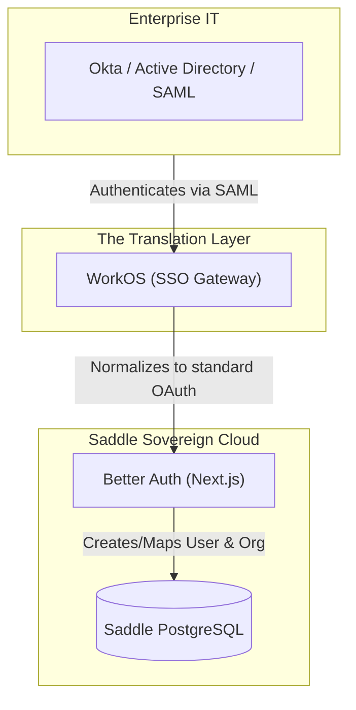

# SADDLE AUTHENTICATION & IDENTITY STRATEGY
## The Data Sovereignty & Enterprise Hedge Protocol

> *"We own the metal, we own the user table."*

---

## 1. The Core Philosophy: Data Sovereignty
In the AI platform era, user data and identity are the most valuable assets. The standard SaaS playbook is to outsource identity to a managed service like Clerk or Auth0.

**We reject this.** Handing over the primary `users` database table to a 3rd-party vendor introduces catastrophic pricing lock-in and violates the Master Blueprint's mandate for sovereign private clusters.

All user data, organizations, session tokens, and role-based access control (RBAC) must live inside the Saddle PostgreSQL database that we control.

---

## 2. The Primary Auth Engine: Better Auth
Saddle's identity layer is built on **Better Auth**, an open-source, edge-compatible authentication framework.

### Why Better Auth?
1. **Direct Database Writes:** It connects directly to our Hetzner/Docker PostgreSQL instance.
2. **Native Multi-Tenancy:** It includes first-class plugins for Organizations and Teams, which is a hard requirement for the Saddle App Store and SaaS collaboration features.
3. **Zero Marginal Cost:** Whether we have 10,000 users or 10,000,000 users, our auth bill remains $0.

### The Consumer (B2C) Flow
For the vast majority of consumer and prosumer users:
- Users log in via Email/Password, Google OAuth, or Apple ID.
- Better Auth handles the OAuth handshake directly.
- The user row is created in *our* database.

---

## 3. The Enterprise Hedge: WorkOS as an IdP
Eventually, Fortune 500 companies will want to deploy Saddle for their teams. Enterprise IT departments mandate Single Sign-On (SSO) via SAML, Okta, or Microsoft Entra ID (Active Directory).

Building SAML integrations from scratch is a massive distraction. But migrating our entire infrastructure to a B2B identity provider just to win one enterprise contract compromises our data sovereignty.

### The Solution: The IdP Proxy Pattern
Instead of letting an enterprise auth provider own our database, we use **WorkOS strictly as an Identity Provider (IdP) plugged into Better Auth.**

### How it works:
1. Disney buys 5,000 seats of Saddle Pro and demands Okta login.
2. We configure WorkOS to connect to Disney's Okta.
3. Inside Better Auth, we add WorkOS as an OAuth provider (just like Google).
4. A Disney employee clicks "Log in with SSO". They authenticate via WorkOS.
5. WorkOS passes the token back to Better Auth.
6. Better Auth creates the Disney employee inside **our PostgreSQL database**, assigning them to the Disney Organization.

**The result:** We capture lucrative Enterprise B2B contracts without ever giving up ownership of the underlying user database. If WorkOS ever raises their prices to an unacceptable level, we can swap them out for another SAML provider without migrating a single row of data in our database.
