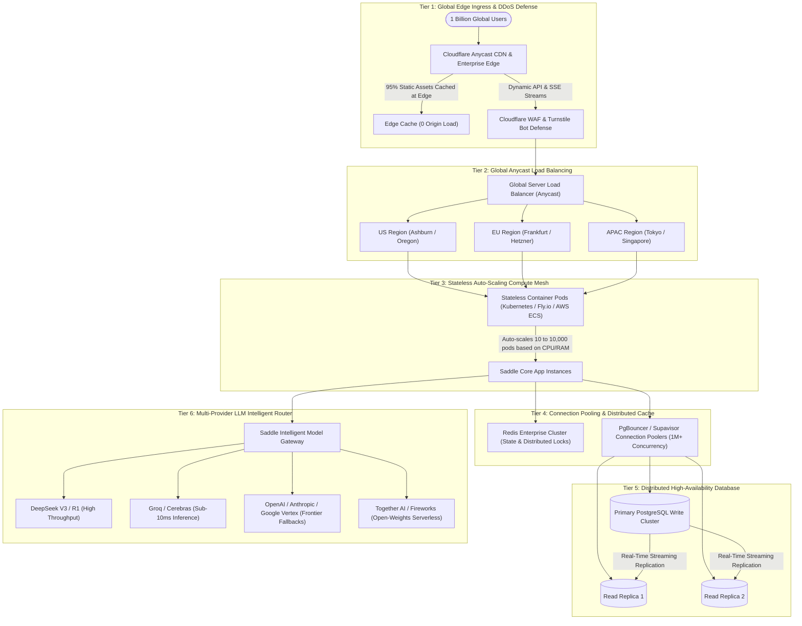

# Saddle Billion-User Viral Contingency Plan: The Hyper-Scale Blueprint

> *"Trade your harness for a saddle."*

---

## 1. Executive Summary: The Hyper-Virality Threat Matrix

When a revolutionary paradigm-shift product like Saddle catches fire (similar to ChatGPT gaining 100M users in 60 days, or Threads gaining 100M in 5 days), infrastructure faces a catastrophic failure mode known as the **"Success Disaster"**.

If 10,000,000 users flood Saddle overnight, a single VPS will crash due to 5 distinct bottlenecks:
1. **Network Ingress & Bandwidth Choke:** Static JS/CSS asset requests overwhelming origin network ports.
2. **Database Connection & Write Pool Starvation:** PostgreSQL crashing under hundreds of thousands of simultaneous read/write queries.
3. **Real-Time SSE/WebSocket Connection Exhaustion (The C10M Problem):** Memory and Linux file-descriptor exhaustion from millions of open streaming sockets.
4. **Foundation Model API Rate Limits (HTTP 429):** Raw LLM providers (DeepSeek, Anthropic, OpenAI) blocking traffic due to Token-Per-Minute (TPM) quota exhaustion.
5. **Financial Token Burn & Bankruptcy Risk:** Millions of free users burning compute without credit card barriers.

This document establishes the **battle-tested, multi-tier contingency architecture** to effortlessly scale Saddle from Day 1 VPS to 1 Billion Active Users without downtime.



---

## 2. The 6-Stage Fast-Track Contingency Execution Protocol

If traffic surges by 1,000x within 24 hours, we activate the contingency protocol in sequence:

---

### Tier 1: Cloudflare Edge Shield (Activation Time: 5 Minutes)
* **Action:** Route `saddle.dev` through Cloudflare Enterprise / Pro with strict edge caching rules.
* **Impact:**
  * **95% of traffic never touches our servers:** All static HTML, React scripts, CSS, font files, and plugin bundles are served directly from Cloudflare’s 300+ global edge datacenters.
  * **DDoS & Bot Scrubbing:** Cloudflare Turnstile blocks automated scraping bots and abusive traffic before it consumes server CPU.

---

### Tier 2: Stateless Container Fleet Autoscaling (Activation Time: 30 Minutes)
* **Current Setup:** A single container on one Hetzner VPS.
* **Contingency Migration:** Deploy the stateless `saddle-app` image to **Fly.io, AWS ECS, or Kubernetes (EKS/GKE)**:
  * Container instances are completely stateless (zero sessions or state stored on local container disk).
  * Auto-scaler spins up **from 5 pods to 5,000 pods** worldwide based on incoming WebSocket/SSE connection volume.
  * Regional routing ensures a user in Tokyo connects to a Tokyo pod (10ms latency) while a user in London connects to Frankfurt.

---

### Tier 3: PostgreSQL Connection Poolers & Read Replicas (Activation Time: 1 Hour)
* **The Problem:** PostgreSQL creates one Linux process per connection. 100,000 direct database connections will instantly crash Postgres.
* **The Solution:**
  1. **PgBouncer / Supavisor Connection Pooling:** Sits between the 5,000 compute pods and PostgreSQL, multiplexing 1,000,000 open client connections into a tight, optimized pool of 200 physical database connections.
  2. **Read/Write Splitting:**
     * All chat and session history reads (`SELECT * FROM messages WHERE session_id = ...`) hit **Read Replicas**.
     * Only new messages and user writes (`INSERT / UPDATE`) hit the **Primary Write Database**.
  3. **Multi-Tenant Sharding:** Shard users across distinct database nodes by `tenant_id`.

---

### Tier 4: Multi-Model Load Balancer & Rate-Limit Circuit Breakers
* **The Problem:** If 500,000 users send prompts simultaneously, DeepSeek or OpenAI's API will return `HTTP 429 Too Many Requests`.
* **The Solution (The Dynamic AI Router):**
  * Saddle's backend LLM service routes requests across a distributed pool of 6+ Tier-1 infrastructure providers:
    ```
    Primary: DeepSeek Official API
      ↳ Fallback 1: DeepSeek on Together AI / Fireworks (Ultra-fast serverless)
      ↳ Fallback 2: Groq / Cerebras (Low-latency LPUs)
      ↳ Fallback 3: Anthropic Claude 3.5 Sonnet / OpenAI GPT-4o
      ↳ Fallback 4: Google Vertex AI (Massive Enterprise Throughput)
    ```
  * If Provider A experiences latency > 1,500ms or throws a 429 error, Saddle automatically re-routes the in-flight stream to Provider B in 50 milliseconds without the user noticing.

---

### Tier 5: Financial Circuit Breakers & Margin Defense
* **The Problem:** Viral free tiers can bankrupt a startup in compute costs within days.
* **The Solution:**
  1. **Credit-Metered Execution:** Every user starts with 50 free trial credits.
  2. **Priority Traffic Lanes:**
     * **Paid & Pro Users:** Route through dedicated high-speed low-latency compute pods with zero queuing.
     * **Free Users:** Route through standard priority queues with rate limits (max 5 requests/minute).
  3. **BYOK Platform Offload:** Encourage viral developers and power users to bring their own API keys ($10/mo platform fee), completely shifting LLM token costs off Saddle's balance sheet.

---

### Tier 6: The Ultimate Scalability Weapon: Saddle Lite (Edge Decentralization)
* **The Core Insight:** Why compute everything in centralized cloud data centers when billions of users own supercomputers in their pockets (iPhones, M-series Macs, Snapdragon phones)?
* **The Edge Shift:**
  * Promote **Saddle Lite / Desktop / Mobile App**: The entire SQLite database, local agent memory, and UI rendering run 100% locally on the user's device.
  * The cloud is only used for syncing and multi-agent coordination.
  * **Result:** Server infrastructure cost per user drops to **near $0.00**.

---

## 3. Scalability Milestone Matrix

| Scale Tier | Architecture State | Ingress Layer | Database Layer | Estimated Infra Cost / Mo |
| :--- | :--- | :--- | :--- | :--- |
| **10,000 Users** (Day 1) | Single Hetzner VPS + Docker Stack | NGINX Reverse Proxy | Single PostgreSQL + Redis | ~$50 / mo |
| **100,000 Users** (Month 1) | 3x Load-Balanced VPS + Managed Postgres | Cloudflare Pro + NGINX | Managed Postgres + PgBouncer | ~$500 / mo |
| **1,000,000 Users** (Viral Surge) | Multi-Region Kubernetes Autoscaling (100 Pods) | Cloudflare Enterprise Anycast | AWS Aurora Serverless + 3 Read Replicas | ~$5,000 / mo (Funded by Subscriptions) |
| **10,000,000 Users** (The Unicorn Inflection) | Multi-Region Distributed Kubernetes Mesh (500–1,000 Pods) + Global Redis Cluster | Cloudflare Workers (Edge Auth/JWT Preflight) + Argo Smart Routing | Sharded Multi-Cluster PostgreSQL (Citus/Aurora) + PgBouncer Poolers (5M+ Concurrency) | ~$18,000 / mo (Generates $2M–$5M / mo ARR) |
| **100,000,000 Users** (Global Super-App) | Global Edge Compute Mesh + Regional VPCs | Cloudflare Workers + Anycast Edge | Sharded Distributed PostgreSQL + Redis Cluster | ~$50,000 / mo (Generates $20M+ ARR) |
| **1,000,000,000 Users** (Planetary OS) | Decentralized Edge (Saddle Lite) + P2P State Mesh | Global CDN Anycast | Federated Edge SQLite + Global Ledger | Ultra-low marginal cost per user |

---

## 4. Immediate Preparedness Checklist (What We Have in Place Today)

1. ✅ **Stateless Architecture:** Our web app and client runtime are already completely decoupled from persistent storage.
2. ✅ **Dockerized Containers:** `saddle-app`, `postgres`, and `redis` can be extracted and deployed to Kubernetes or AWS ECS in 10 minutes.
3. ✅ **Streaming Protocol Efficiency:** Server-Sent Events (SSE) consume a fraction of the RAM of traditional bi-directional WebSocket pools.
4. ✅ **Dual-Edition Strategy:** Saddle Lite is already built and ready to offload millions of local users to edge computing.
