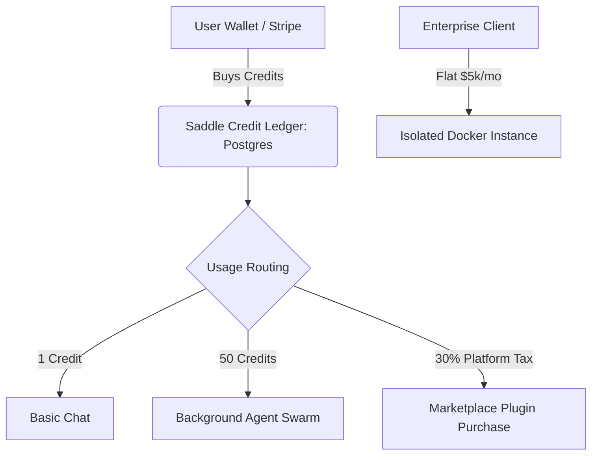

# Saddle Platform: Business & Monetization Strategy

## Executive Summary
Saddle is evolving from a single-user AI framework (a "harness") into a multi-tenant, dynamically generated operating system (a "saddle"). Because the Cordis architecture streams *capabilities* rather than just static text, it opens up highly lucrative, margin-protected revenue streams that traditional wrappers cannot access.

By operating as an independent Progressive Web App (PWA) powered by Stripe, Saddle bypasses the 30% Apple/Google App Store tax, keeping 100% of the margins.

---

## Core Revenue Streams

### 1. Usage-Based Compute Credits (Margin Protection)
A flat SaaS subscription is dangerous for agentic platforms where users can run background tasks overnight. Saddle will use a prepaid utility model.
* **Mechanism:** Users purchase "Saddle Credits" (e.g., $10 for 1,000 credits).
* **Consumption:** Simple chat queries cost 1 credit. Spawning a background agent to scrape the web overnight costs 50 credits.
* **Business Value:** Mathematically guarantees profitability. You apply a fixed 3x–5x markup on the raw LLM and server compute costs. As users scale their AI labor, your revenue scales linearly without risking bankruptcy.

### 2. The Cordis Plugin Marketplace (The Ecosystem Play)
Saddle's greatest moat is its ability to inject dynamic UI and backend tools at runtime. We will monetize this ecosystem.
* **Mechanism:** A centralized marketplace where users can buy premium, specialized plugins (e.g., "Bloomberg UI Data Visualizer" or "SEO Agent Swarm").
* **Monetization:** Third-party developers (and AI) build these plugins. Users buy them with Saddle Credits. **The platform takes a flat 30% transaction fee** on all third-party sales.
* **Business Value:** Network effects. You make money while you sleep by taxing the ecosystem, exactly like the iOS App Store, but without answering to Apple.

### 3. Enterprise White-Labeling (High MRR Whales)
Corporations want the power of a dynamic AI OS, but they require strict data privacy, Single Sign-On (SSO), and custom branding.
* **Mechanism:** Selling dedicated, isolated Docker containers of Saddle to B2B clients.
* **Monetization:**
  * **$2,000 - $5,000 / month** licensing fee per instance.
  * Custom branding included (leveraging the theming engine we built, like the Palomino/Friesian palettes).
  * High-markup enterprise compute credits.
* **Business Value:** Extremely sticky recurring revenue. Securing just 10 enterprise clients provides a guaranteed $20k–$50k monthly baseline.

### 4. Entry Tier: Bring Your Own Key (BYOK) & Cost Protection
* **Mechanism:** A $10/month "Platform Fee". The user provides their own DeepSeek/OpenAI API key.
* **Business Value:** Pure margin on AI inference. You provide the UI/OS, they pay the AI compute costs directly to the provider.
* **CRITICAL INFRASTRUCTURE PROTECTION:** Even without token costs, BYOK users can bankrupt the platform through *server abuse* (spawning dozens of background agents, hoarding RAM and database storage). To guarantee profitability, the BYOK tier enforces:
  * **Compute Throttling:** Strict Redis-enforced caps on concurrent background jobs (e.g., max 2 simultaneous agents).
  * **Storage Quotas:** Postgres-enforced limits on artifact and session database size (e.g., 1GB max).
  * **Premium Compute Tolls:** Server-heavy plugins (e.g., headless browsing, video rendering) still require "Saddle Credits" to cover our CPU tax, even if the LLM tokens are free to us.

---

## Technical Prerequisites for Monetization
To execute this business model, the current single-user SQLite architecture must be upgraded. The immediate engineering roadmap includes:

1. **Postgres Migration:** Required to build a secure relational ledger for tracking user balances, Stripe IDs, and plugin ownership.
2. **Redis Integration:** Required for strict rate-limiting and managing background agent task queues so users cannot overwhelm the server.
3. **Dockerization:** Containerizing the backend ensures we can instantly spin up isolated environments for Enterprise clients.

