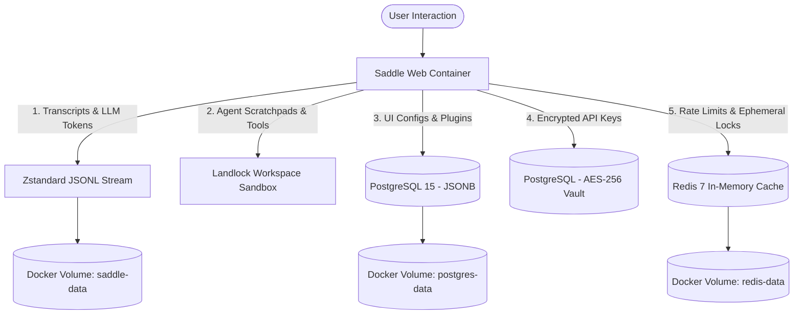
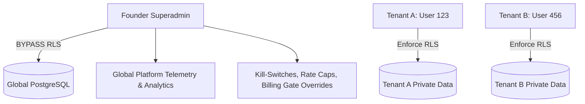

# Saddle Data Lifecycle, Storage Topography & Superadmin Architecture

---

## 1. Should You Test Chatting Right Now? (The Immediate Verdict)

**YES. Go ahead and test it aggressively on `http://91.99.165.95:3080`.**

* **Zero VPS Clog Risk:** AI chat sessions, agent logs, and JSONL transcripts use negligible disk space. Because Saddle uses Meta's **Zstandard (`zstd`)** compression, thousands of messages take up only a few megabytes.
* **The Transition Plan:** When we launch Sprint 2 (PostgreSQL Multi-Tenancy & Row-Level Security), you have two frictionless options:
  1. **Claim the Data:** We can automatically assign all pre-existing test conversations to your **Founder Superadmin** account (`tenant_id = 'founder-0001'`).
  2. **Clean-Slate Wipe:** If you prefer a pristine database at launch, a single command (`docker compose down -v`) resets the isolated Docker volumes in 3 seconds without touching the server's OS.

---

## 2. Complete Data Map: What Data Does Saddle Generate?

Saddle generates five distinct categories of data during operation:

### The 5 Data Categories:
1. **Conversation Transcripts (`.jsonl.zst`):**
   * Raw prompt/response turns, token counts, model metadata, reasoning blocks.
   * Format: Compressed JSON Lines streaming directly to disk.
2. **Subagent Workspaces & Tool Execution Logs:**
   * Intermediate tool calls (bash output, file diffs, web searches, AST parser trees).
   * Sandboxed in Landlock-restricted directory paths.
3. **User Preferences & Plugin States (PostgreSQL JSONB):**
   * Active UI slots, sidebar positions, enabled plugins, layout overrides, custom themes.
4. **Credential Vault (Encrypted PostgreSQL):**
   * User-supplied BYOK API keys (DeepSeek, OpenAI, Anthropic) encrypted with **AES-256-GCM** with unique initialization vectors (IV).
5. **Ephemeral State & Cache (Redis 7):**
   * Server-Sent Events (SSE) stream multiplexing, rate-limiting counters, active job concurrency locks.

---

## 3. Infrastructure Architecture: Containerized vs. Bare Metal

Saddle on Hetzner is built entirely on a **Production Containerized Micro-Stack** managed by Docker Compose:

| Component | Architecture | Isolation Boundary | Storage Volume |
| :--- | :--- | :--- | :--- |
| **`saddle-app`** | Node.js / TypeScript App | Linux Container (Port 3080) | `saddle-data:/app/data` |
| **`saddle-postgres`** | PostgreSQL 15 Alpine | Loopback only (`127.0.0.1:5432`) | `postgres-data:/var/lib/postgresql/data` |
| **`saddle-redis`** | Redis 7 Alpine | Loopback only (`127.0.0.1:6379`) | `redis-data:/data` |

### Why Containerized Beats Bare Metal for Saddle:
* **Zero Dependency Drift:** Node, PNPM, Postgres, and Redis versions are pinned. Updates never break host libraries.
* **Loopback Security Fence:** PostgreSQL and Redis do not expose public ports; they communicate strictly over Docker's internal bridge network.
* **Instant Disaster Recovery:** Backups are as simple as snapshotting the 3 named Docker volumes.

---

## 4. Superadmin Architecture: Present vs. Future

### Current State (Phase 1 / Single-Operator Mode)
* **Access Model:** Root operator access. Anyone reaching port 3080 acts as the default local session owner.
* **Protection:** DNS-Rebinding / Host Whitelisting trust fence ensures external unauthorized hostnames cannot spoof API requests.

### Future State (Sprint 2 / Multi-Tenant SaaS Engine)
When Sprint 2 is implemented, the Superadmin hierarchy unlocks:

* **Row-Level Security (RLS) Enforcement:** Every table row (`sessions`, `messages`, `vault`, `plugins`) is stamped with `tenant_id` and `user_id`. Standard users can *mathematically never query another user's rows*.
* **Founder Superadmin Privilege:**
  * Assigned `role = 'superadmin'`, enabling PostgreSQL `BYPASSRLS`.
  * **Global Telemetry Dashboard:** Live monitoring of active subagents, global token burn, server memory, and monthly recurring revenue (MRR).
  * **System Controls:** Ability to adjust global BYOK concurrency gates, push emergency system notices, and manage the plugin marketplace approval queue.
