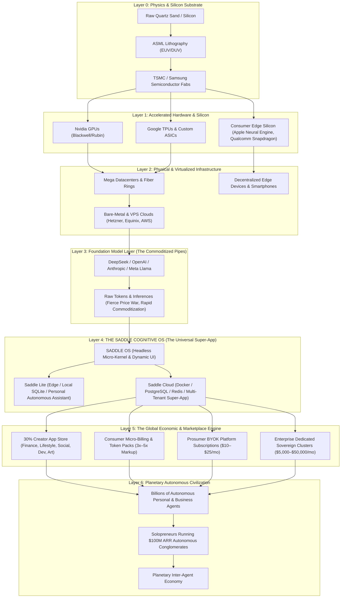
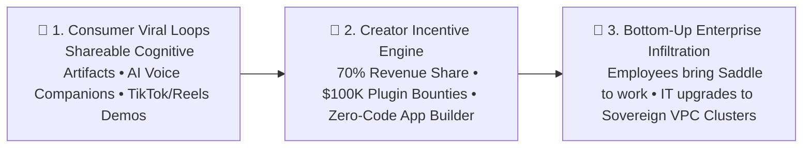

# THE SADDLE MASTER BLUEPRINT
## From Silicon to Planetary Super-App: The Architecture of the Universal Cognitive Operating System

> *"Trade your harness for a saddle."*

---

## 1. Executive Summary & The Planetary Thesis

The first era of artificial intelligence was defined by **creation**—training ever-larger models on raw compute in massive data centers. The second era is defined by **the universal human interface**—how billions of consumers, creators, and enterprises interact with, steer, and monetize autonomous intelligence in daily life.

Historically, software has been locked into rigid, single-purpose silos. You open Instagram for social media, Excel for spreadsheets, VS Code for coding, Uber for transport, and ChatGPT for a text box. Every app's pixels and workflows were statically hardcoded months prior by an engineering team.

**Saddle is the paradigm shift: The Everything Super-App of the AI Era.**

Saddle is not merely a tool for software developers; it is the **Universal Cognitive Operating System for Humanity**—aiming for the scale and ubiquity of **Apple iOS, Instagram, Facebook, and WeChat**.

* **For the Everyday Consumer:** Saddle is a hyper-personalized life companion, financial advisor, creative studio, automated shopper, travel concierge, and 24/7 personal digital twin.
* **For the Creator & Prosumer:** Saddle is an open canvas and an economic engine where anyone can build, share, and monetize customized cognitive experiences with a 70/30 revenue share.
* **For the Enterprise:** Saddle is an air-gapped, sovereign digital workforce orchestrating complex operations, compliance, customer support, and fleet automation with zero data leakage.

```mermaid
graph TD
    subgraph MassScale ["🌍 The Three Pillars of Planetary Adoption"]
        Consumer["1. Mass Consumer (1B+ Daily Active Users)
        Personal Life-Pilot • Creative Canvas • Autonomous Concierge • Education"]
        Creator["2. Creator & Prosumer Flywheel (Millions of Builders)
        Custom SADDLE Plugins • 70/30 Revenue Share • Domain Templates"]
        Enterprise["3. Institutional & Enterprise (Fortune 500 & Governments)
        Sovereign Private Clusters • Zero Data Leakage • Autonomous Workforces"]
    end

    subgraph CoreEngine ["⚡ SADDLE UNIVERSAL COGNITIVE OS"]
        Cordis[Cordis Inversion-of-Control Micro-Kernel]
        Slots[Dynamic UI Slot & Outlet Canvas (ui-slots)]
        Auth[Multi-Tenant PostgreSQL & Encrypted Vault]
        Marketplace[Global Stripe Payment & Plugin Distribution Rails]
    end

    Consumer --> CoreEngine
    Creator --> CoreEngine
    Enterprise --> CoreEngine
```

---

## 2. The Macro Value Chain: From Sand to Civilization

To understand why Saddle is a generational platform, we must dissect the entire chain of production that transforms quartz sand into autonomous global intelligence.



### Strategic Analysis of the Value Chain

1. **Why we DO NOT play at Layer 3 (The Model Layer):**
   * Training foundation models costs hundreds of millions of dollars in CapEx, data, and power.
   * Model weights are rapidly commoditized: open-weights (DeepSeek, Llama, Mistral) are matching closed models at fractions of the cost.
   * Inference is a race to zero margins.

2. **Why Layer 4 (Saddle - The Universal Super-App) Captures 90% of Value:**
   * **The User Relationship (The Consumer & Enterprise Front Door):** Foundation models are interchangeable backend compute pipes. If DeepSeek has an outage, Saddle routes to Anthropic, OpenAI, or a local Llama model on device in 1 millisecond. The user stays inside Saddle.
   * **The Dynamic UI Super-Power:** Unlike static chat apps (ChatGPT, Claude), Saddle's UI morphs in real time into whatever interface the user needs—a budgeting ledger, an interactive flight booking map, a video editing timeline, a social networking feed, or a coding IDE.
   * **Network Effects & Creator Lock-In:** Millions of third-party plugins in our 30% marketplace create an insurmountable ecosystem moat, identical to Apple's App Store and WeChat's Mini-Programs.

---

## 3. The Core Developer Mindset: What to Build vs. What to Leave for the World

As the Founder and Core Platform Engineer of Saddle, your focus must remain razor-sharp on building **The Unshakeable Substrate**, leaving the infinite varieties of end-user applications to the ecosystem.

```
┌────────────────────────────────────────────────────────────────────────────┐
│                    THE ECOSYSTEM / USERS / CREATORS                        │
│  • Personal Finance Planners     • Fitness & Health Trackers               │
│  • Social Media Orchestrators    • Travel Booking Concierges               │
│  • Specialized Coding Sandboxes  • 3D Gaming & Creative Studios            │
└─────────────────────────────────────┬──────────────────────────────────────┘
                                      │
                           Mounts into Outlets
                                      │
┌─────────────────────────────────────▼──────────────────────────────────────┐
│                  YOUR JOB (THE CORE PLATFORM DEVELOPER)                    │
│  1. Bulletproof Root Geometry & Responsive Viewports (Mobile & Desktop)    │
│  2. High-Throughput Slot & Outlet Engine (@saddle/ui-slots)               │
│  3. Real-Time Observable Event Streams (SSE / Sub-10ms Projections)        │
│  4. PostgreSQL Multi-Tenant Auth, RLS & Encrypted Key Vault                │
│  5. Sandboxed Micro-Jails & Process Security (Landlock / Wasm / ShadowDOM) │
│  6. Global Payment, Billing & Creator Marketplace Rails (Stripe / MoR)     │
└────────────────────────────────────────────────────────────────────────────┘
```

### The Core Developer Decision Matrix:
* **Core Codebase (Your Work):** Root CSS layout physics, HTML browser directives (`viewport-fit=cover`), Slot Outlet definitions (`<SlotOutlet name="..." />`), database schemas, security fences, JWT auth, and payment metering.
* **Plugins & Themes (The World's Work):** Specific domain tools, custom visual cards, unique prompt sequences, color palettes, and niche business workflows.

---

## 4. Consumer, Creator, and Enterprise Product Tiers

### Tier 1: Saddle Consumer ("Your Cognitive Companion")
* **Target Audience:** General public, students, parents, executives, creators, freelancers (1B+ potential users).
* **Core Experience:**
  * Clean, breathtaking, warm equestrian design (Palomino, Friesian, Chestnut).
  * Natural multi-modal interaction: Voice waveforms, image recognition, instant web automation.
  * Automated life management: Email triage, flight comparison, personal budgeting, meal planning, and learning companions.
* **Monetization:** Free starter tier + $9.99/mo Consumer Plus or Pay-As-You-Go credit packs with 3x–5x margins.

### Tier 2: Saddle Pro & Creator ("The Autonomous Studio")
* **Target Audience:** Power users, developers, marketers, designers, quants, solopreneurs.
* **Core Experience:**
  * Bring-Your-Own-Key (BYOK) support for unlimited frontier intelligence.
  * Access to the full Cordis Plugin Marketplace and multi-agent swarm orchestrators.
  * Developer SDK to build and monetize plugins with 70% direct revenue share.
* **Monetization:** $19.99/mo Pro Platform pass + 30% marketplace commission.

### Tier 3: Saddle Enterprise ("The Autonomous Corporation")
* **Target Audience:** Mid-market to Fortune 500 enterprises, law firms, healthcare institutions, financial institutions.
* **Core Experience:**
  * Dedicated single-tenant VPC deployments on AWS/GCP/Hetzner with full data sovereignty.
  * Okta/Google SAML SSO, immutable audit logging, and DLP compliance guardrails.
  * Zero-data-retention agreements guaranteeing proprietary company IP is never used for training.
* **Monetization:** $5,000 – $50,000/month custom enterprise contracts.

---

## 5. Planetary Distribution & Marketing Strategy (The Super-App Playbook)

To achieve the cultural and commercial scale of Instagram, Facebook, and OpenAI, Saddle employs a three-stage viral distribution flywheel:



1. **Shareable Cognitive Artifacts (Consumer Virality):**
   * Any interactive artifact generated in Saddle (e.g. an interactive 3D map, a custom budgeting widget, a synthesized research report) can be shared with a single public link (`saddle.link/xyz`), driving thousands of new consumer signups per day.
2. **The 70/30 Creator Economy Gold Rush:**
   * Just like the Apple App Store created the first generation of app millionaires, the Saddle Marketplace will create the first generation of **Autonomous Agent Millionaires**.
3. **Bottom-Up Enterprise Adoption (The Slack/Figma Playbook):**
   * Individual knowledge workers use Saddle Pro for daily productivity. Teams naturally form inside organizations, forcing IT departments to upgrade to Saddle Enterprise for governance and security.
