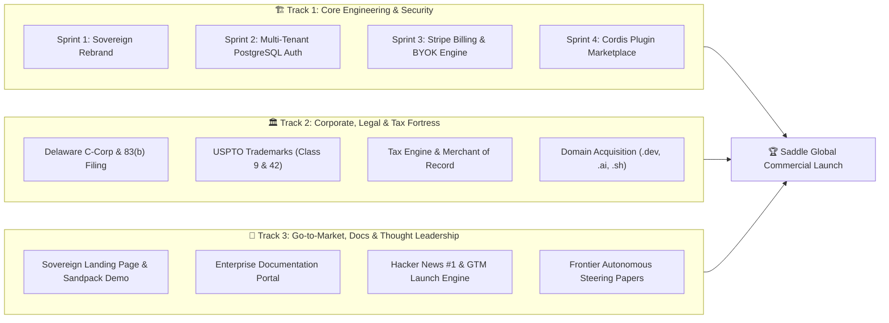
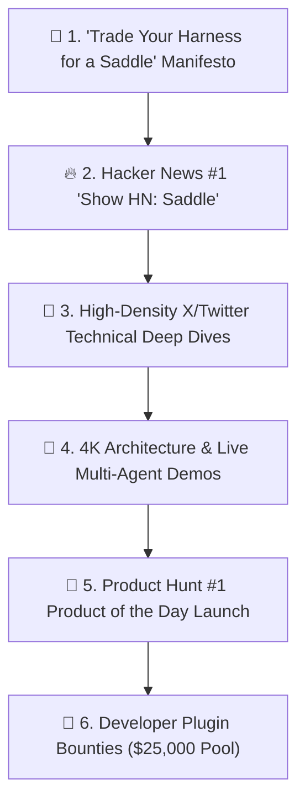

# Saddle Master Execution Plan: Institutional-Grade Enterprise Roadmap

> *"Trade your harness for a saddle."*

Saddle is built to stand alongside the most prestigious and formidable engineering powerhouses of the 21st century—**OpenAI, Anthropic, SpaceX, and Meta**.

Because artificial intelligence evolves at exponential velocity, our execution strategy is aggressive, disciplined, and dual-tracked: we execute **frontier engineering and research** while simultaneously constructing an **institutional-grade corporate, legal, financial, and marketing fortress**.



---

## Part 1: The Phased Engineering & Product Sprints

### Sprint 1: Sovereign Brand & Complete UI Rebrand (Week 1 — Active)
*Objective: Eradicate all legacy strings and establish Saddle's sovereign identity.*
1. **User-Facing UI Rebranding:**
   * Browser `<title>` and OpenGraph tags: `Saddle | The Autonomous AI OS` (and `Saddle Lite` on desktop).
   * Header logo, SVG icons, navigation bars, and footer copyright updated to official Saddle branding.
   * Default agent presets, system prompts, and placeholder text rebranded.
   * Web App manifest, theme colors (Palomino, Friesian, Chestnut), and favicons updated.
2. **Infrastructure & CLI Renaming:**
   * CLI command alias: `saddle` (e.g. `saddle web`, `saddle start`).
   * Startup terminal banner: `"Welcome to Saddle OS v1.0"`.
   * Docker container naming: `saddle-app-1`, `saddle-postgres-1`, `saddle-redis-1`.

---

### Sprint 2: Multi-Tenant PostgreSQL Authentication & Scoping (Weeks 2 – 3)
*Objective: Transform Saddle into an ultra-secure, multi-tenant enterprise system.*
1. **PostgreSQL Relational Schema & Row-Level Security (RLS):**
   * `users` (id, email, password_hash, role: `owner` | `admin` | `member`, created_at).
   * `tenants` (id, name, tier: `free` | `credits` | `byok` | `enterprise`, custom_domain).
   * `sessions` & `messages` (id, tenant_id, user_id, title, payload, token_count).
   * `credentials_vault` (id, user_id, provider, encrypted_secret via AES-256-GCM).
   * `user_installed_plugins` (id, user_id, plugin_id, is_enabled, slot_overrides, user_config).
2. **Automatic Founder Superadmin Migration:**
   * Automatic ingestion of pre-Sprint-2 `.jsonl.zst` chats and DeepSeek API keys directly into the Superadmin profile.
3. **Sandbox Micro-Jail Isolation:**
   * Ephemeral per-user chrooted Landlock micro-jails on Linux VPS preventing cross-tenant file access.

---

### Sprint 3: The Billing Engine & BYOK Margin Defense (Weeks 4 – 5)
*Objective: Turn on Stripe checkout, credit metering, and compute margin protection.*
1. **Stripe Checkout & Automated Webhooks:**
   * **Prepaid Credit Packs:** $10 (1,000 credits), $50 (5,500 credits), $100 (12,000 credits).
   * **BYOK Subscription:** $10/month recurring subscription.
2. **Real-Time Token & Task Metering:**
   * Chat turn: 1 credit.
   * Autonomous background task: 50 credits/run.
   * **3x–5x markup** applied automatically on raw LLM token costs.
3. **BYOK Abuse Defense Layer:**
   * **Redis Concurrency Cap:** Max 2 simultaneous background agents for BYOK users.
   * **Storage Quotas:** 1GB session & artifact limit per BYOK account.
   * **Platform Compute Tolls:** Headless browser runs and sandbox executions deduct compute credits even for BYOK users.

---

### Sprint 4: The 30% Creator Plugin Marketplace (Weeks 6 – 7)
*Objective: Launch the App Store of Autonomous Agents.*
1. **Plugin Submission & Review Pipeline:**
   * CLI command `saddle publish` pushes signed tarballs to the Saddle Registry.
2. **Dynamic Slot Occupancy:**
   * Third-party plugins mount custom UI cards, HUDs, and tools directly into Saddle Outlets.
3. **Stripe Connect Split-Payments:**
   * 70% of plugin sales route to third-party developers; 30% retained in Saddle Treasury.

---

### Sprint 5: Enterprise Dedicated Workstations ($5,000/mo) (Weeks 8 – 9)
*Objective: High-ACV (Annual Contract Value) B2B enterprise procurement.*
1. **Single-Tenant VPC Deployments:** Automated Terraform/Ansible scripts to deploy private Saddle clusters on AWS, GCP, or Hetzner Bare Metal.
2. **SAML 2.0 & Okta / Google Workspace SSO:** Enterprise Single Sign-On.
3. **Immutable Cryptographic Audit Logs:** Recording every tool call and file edit for compliance.

---

## Part 2: Corporate, Legal, Tax & Domain Fortress

To operate at the level of OpenAI, SpaceX, and Meta, Saddle requires an unassailable legal, tax, and intellectual property foundation:

```mermaid
graph TD
    subgraph Corporate ["🏛️ Legal Entity & Equity"]
        DE[Delaware C-Corporation]
        IP[Founder IP Assignment Agreement]
        E83[Section 83(b) Tax Election]
        Vesting[4-Year Founder Equity Vesting w/ 1-Yr Cliff]
        CapTable[Cap Table Management via Carta/Pulley]
    end

    subgraph TaxCompliance ["💳 Tax & Global Merchant of Record"]
        MoR[Stripe Tax / Merchant of Record Engine]
        VAT[Automated EU VAT Reverse Charge & B2B Tax ID Validation]
        US_Tax[Automated US State Sales Tax Nexus Compliance]
        Invoicing[B2B Net-30 Invoicing & Wire Transfer Rails]
    end

    subgraph BrandIP ["🛡️ Brand Defense & Domain Acquisition"]
        Domains[Primary Domain Acquisition Strategy: .dev, .ai, .sh, .co]
        Trademark9[USPTO Class 9: AI Operating System Software]
        Trademark42[USPTO Class 42: SaaS Autonomous Agent Platform]
    end
```

### 1. Corporate Entity & Equity Structuring
* **Entity Type:** **Delaware C-Corporation** (standard for high-growth venture-scale tech companies).
* **Section 83(b) Election:** Filed with the IRS within 30 days of stock issuance to avoid massive personal tax liabilities as company valuation grows.
* **Proprietary Information & Inventions Agreement (PIIA):** 100% of Saddle code, algorithms, architectural blueprints, and trademarks explicitly assigned to the corporate entity.
* **Stock Vesting Schedule:** Standard 4-year vesting with a 1-year cliff and double-trigger acceleration on acquisition.
* **Investment Vehicles:** Standard **Y Combinator Post-Money SAFE (Simple Agreement for Future Equity)** agreements prepared for angel and venture rounds.

### 2. Tax, Merchant of Record (MoR) & Global Compliance
* **Payment & Tax Stack:** **Stripe Billing + Stripe Tax** (or Merchant of Record like **Paddle / Lemon Squeezy**):
  * **Automated Economic Nexus Detection:** Automatically monitors US sales thresholds per state and collects local sales taxes.
  * **EU VAT & UK VAT Compliance:** Automatically validates VAT numbers for European B2B customers and calculates reverse-charge VAT.
  * **Automated B2B PDF Invoicing:** Generates compliant enterprise invoices with corporate tax IDs, PO numbers, and ACH/SEPA wire instructions.
* **Accounting & Bookkeeping:** QuickBooks Online / Xero integrated directly with Stripe to maintain audit-ready GAAP financials.

### 3. Domain Acquisition & Brand Defense
* **Target Primary Domains:**
  1. `saddle.dev` (Ideal developer-native hub)
  2. `saddle.ai` (Frontier AI positioning)
  3. `saddle.sh` (Command-line / OS hacker aesthetic)
  4. `saddle.co` / `saddle.io` (Commercial fallback)
* **Trademark Protection:**
  * **USPTO Trademark Filings:**
    * **Class 9 (Software):** Downloadable AI software, agent runtime software, autonomous developer operating systems.
    * **Class 42 (SaaS):** Cloud-hosted cognitive operating systems, AI-powered code orchestration, and platform-as-a-service.

---

## Part 3: World-Class Landing Page & Enterprise Documentation

### 1. The Sovereign Landing Page (`saddle.dev`)
* **Design Philosophy:** Dark sovereign aesthetic, high-contrast typography (Inter/Geist), equestrian leather accent tokens (Chestnut, Palomino, Friesian), and 60 FPS Framer Motion micro-interactions.
* **Key Page Sections:**
  1. **The Hero Section:**
     * Headline: *"Trade Your Harness for a Saddle."*
     * Subheadline: *"The first headless, fully composable Autonomous AI Operating System. Stop chatting with models in rigid wrappers—steer frontier intelligence with sovereign control."*
     * CTA: `[Start Free Trial]` & `[Read the Manifesto]`
  2. **Interactive Live Sandpack Playground:**
     * An embedded live browser terminal running a lightweight Saddle agent session in WebAssembly, letting visitors experience sub-10ms tool execution without signing up.
  3. **The Architectural Shift (Side-by-Side Comparison):**
     * Visual breakdown comparing the rigid "Harness" of traditional IDEs vs the metamorphic "Saddle" canvas.
  4. **The 30% Creator Economy Spotlight:**
     * Highlighting the plugin ecosystem and revenue-share model for developers.
  5. **Transparent Pricing Matrix:**
     * Free Tier ($0), BYOK Pro ($10/mo), Compute Power Pack ($50), and Enterprise Dedicated ($5,000/mo).

---

### 2. The Enterprise Documentation Portal (`docs.saddle.dev`)
Built on **Mintlify / Nextra** with the benchmark quality of Stripe, OpenAI, and Vercel:

```
docs.saddle.dev/
├── 1. Getting Started/
│   ├── Quickstart (Zero to Autonomous Agent in 2 minutes)
│   ├── Architecture Overview (Cordis, Outlets, Projections)
│   └── Choosing Your Edition: Saddle Lite vs. Saddle Cloud
├── 2. Core Concepts/
│   ├── The Dynamic Slot Registry (ui-slots)
│   ├── Observable Projections & SSE Event Streams
│   ├── The Context & Tool Execution Lifecycle
│   └── Multi-Agent Swarm Orchestration
├── 3. Plugin Development SDK/
│   ├── Building Your First Cordis Plugin
│   ├── Creating Custom UI Views & Slot Occupants
│   ├── Publishing to the 30% Creator Marketplace
│   └── Security Fences & Sandboxing Guidelines
├── 4. Self-Hosting & Deployment/
│   ├── Docker Compose Deployment Guide
│   ├── Hardening VPS Firewalls & Reverse Proxies (NGINX)
│   └── Multi-Tenant PostgreSQL Configuration
└── 5. API & Remote Reference/
    ├── REST & SSE Gateway Endpoints
    ├── JSON-RPC 2.0 Agent Protocol
    └── TypeScript SDK Reference
```

---

## Part 4: The Launch & Go-to-Market (GTM) Marketing Engine



### 1. The Launch Sequence Playbook
* **Phase 1: The Technical Manifesto (Day 1):**
  * Publish a 3,000-word philosophical and technical essay: *"Why Modern AI IDEs Are Wrong: The Architectural Case for Headless Cognitive OS"*.
  * Distribution across Substack, Hacker News, and X/Twitter.
* **Phase 2: The "Show HN" Launch:**
  * Post title: `Show HN: Saddle – A headless, fully composable autonomous AI operating system`.
  * Detailed first comment breaking down why Cordis IoC + Dynamic React Outlets solve the Electron/VSCode bloat.
* **Phase 3: The 4K Cinematic Demo & YouTube Deep Dives:**
  * High-production 3-minute video showing 8 parallel subagents building a full-stack SaaS live while the UI morphs in real time.
* **Phase 4: Developer Advocate Bounties ($25,000 Grant Pool):**
  * Award grants to open-source creators who build the top 10 most innovative Cordis plugins (e.g. 3D game engines, Bloomberg finance HUDs, live SQL visualizers).

---

## Part 5: Research & Frontier Thought Leadership

To maintain authority alongside research labs like DeepSeek, Anthropic, and OpenAI:

1. **Quarterly Technical Whitepapers:**
   * *Paper 1: "Decentralized Edge Agent Orchestration: Reducing Cloud Compute Bottlenecks via P2P Cognitive Networks"*.
   * *Paper 2: "Observable State Projections: Achieving Sub-10ms UI Reactive Latency in Heavy Multi-Agent Swarms"*.
2. **Public Benchmarking Suite (`saddle-bench`):**
   * An open-source benchmark measuring agent tool-use accuracy, context compaction efficiency, and task completion speed across frontier foundation models.
3. **Open-Source Core, Proprietary Cloud:**
   * Saddle Lite remains a pristine, zero-telemetry, open-source local workstation that wins developer trust worldwide, while Saddle Cloud / Enterprise captures high-margin multi-tenant revenue.

---

## Master Timeline & Milestone Overview

| Milestone | Target Date | Core Focus |
| :--- | :---: | :--- |
| **Sprint 1: Sovereign Rebrand** | Week 1 | Complete brand eradication of `dsh`, official Saddle UI/CLI |
| **Sprint 2: PostgreSQL Auth & RLS** | Weeks 2–3 | Multi-tenant user isolation, encrypted key vault, Superadmin migration |
| **Legal & Corporate Formation** | Weeks 2–3 | Delaware C-Corp, 83(b), IP assignment, Stripe Tax setup |
| **Sprint 3: Stripe Billing Engine** | Weeks 4–5 | Prepaid credits, BYOK subscription, rate-limiting & concurrency caps |
| **Landing Page & Docs Portal** | Weeks 5–6 | `saddle.dev` landing page and `docs.saddle.dev` Mintlify portal live |
| **Sprint 4: Plugin Marketplace** | Weeks 6–7 | 70/30 creator revenue split, `saddle publish` CLI pipeline |
| **Public GTM Launch Day** | Week 8 | Hacker News #1, Technical Manifesto, Product Hunt, YouTube launch |
| **Sprint 5: Enterprise Clusters** | Weeks 9–10 | $5k/mo private VPC deployments, SAML SSO, SOC2 audit preparation |
