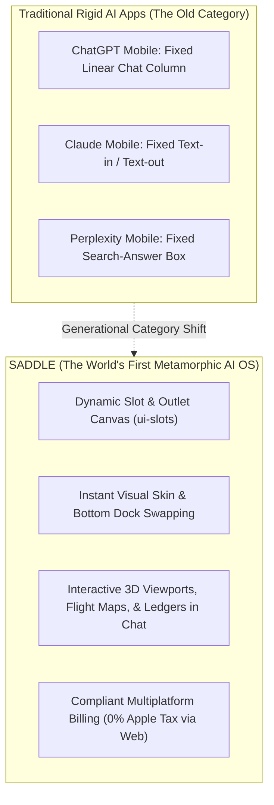

# Saddle Mobile Monetization & The World's First Metamorphic AI App

> *"Trade your harness for a saddle."*

---

## 1. Executive Summary: The World's First Non-Rigid Mobile AI OS

Saddle is the **world's first dynamic, metamorphic mobile AI application**—an architectural category leap that breaks the rigid constraints of traditional AI mobile apps like ChatGPT, Claude, and Perplexity.

Furthermore, Saddle's monetization architecture is **100% compliant with Apple App Store and Google Play Store policies**, legally maximizing profit margins while bypassing restrictive platform fees.

---

## 2. Monetization Defense: Why We Will Have Zero Problems with Apple & Google

Saddle's monetization model complies with **Apple App Store Guideline 3.1.3(b) (Multiplatform Services)**—the identical legal framework utilized by **ChatGPT, Spotify, Netflix, and Adobe Creative Cloud**:

| Monetization Route | Where Purchased | Payment Engine | Platform Fee | Legal Mechanism |
| :--- | :--- | :--- | :---: | :--- |
| **Web Subscriptions** | `saddle.dev` | Stripe Billing / MoR | **0%** (Full Margin) | Apple Guideline 3.1.3(b) Multiplatform Rule |
| **BYOK Platform Pass ($10/mo)** | `saddle.dev` | Stripe Billing | **0%** | Web-based software utility |
| **Mobile Credit Packs** | Inside iOS/Android App | Apple IAP / Google Play | Standard 15% / 30% | Frictionless 1-tap mobile conversion |
| **Enterprise Dedicated ($5k/mo)** | Corporate Invoicing | Wire / ACH / Net-30 | **0%** | B2B Enterprise contract |

### How It Works for the End User:
1. A user buys a $50 Saddle Credit Pack or $10/mo BYOK plan on the web (`saddle.dev`) via Stripe.
2. They download the Saddle iOS App from the Apple App Store.
3. They log in with their email.
4. **All credits, agent sessions, plugins, and BYOK capabilities are instantly available on their iPhone with 0% platform deduction taken by Apple.**
5. New mobile-only users who discover Saddle in the App Store can purchase credits via Apple FaceID In-App Purchase in 2 seconds.

---

## 3. Why Saddle is the First "Non-Rigid" AI App on Earth

Every AI app currently on the Apple App Store is a **rigid, single-purpose text column**:
* **ChatGPT Mobile:** A text bubble stream + voice mode. You cannot rearrange the layout, you cannot add custom financial tabs, and deliverables are flat markdown.
* **Claude Mobile:** A text column. No visual tools, no live interactive widgets, no plugin ecosystem.
* **Perplexity Mobile:** A search engine wrapper.

### The Saddle Metamorphic Superpower on Mobile:
In Saddle, the mobile screen is **alive**:
1. **Adaptive Deliverables:** When an agent produces a financial forecast, instead of dumping 500 lines of text, the chat turn morphs into a **live interactive mobile slider chart**.
2. **Dynamic Bottom Sheets:** When booking travel or reviewing code diffs, interactive sub-canvases slide up smoothly from the bottom with native gesture controls.
3. **Multi-Agent Fleets in Your Pocket:** Users can view a live grid of 4 background agents running parallel research tasks with real-time CPU/token meters.

---

## 4. Can Mobile Users Natively Customize the Interface?

### **YES, 100%! Mobile Customization is Identical to Desktop.**

Mobile users have full sovereignty over their visual and functional experience:

1. **Bottom Navigation vs. Top Hamburger:**
   * A mobile user can switch from the traditional slide-out sidebar to an **Instagram/TikTok style bottom dock** (`[Feed] [Agents] [New Chat (+)] [Tools] [Settings]`) via the `shell.mobile_trigger` slot.
2. **Instant Theme & Aesthetic Swapping:**
   * Toggle between warm equestrian luxury (**Palomino**, **Friesian**, **Chestnut**), high-contrast OLED Dark Mode, or Cyberpunk neon—with instant CSS token re-rendering without restarting the app.
3. **Dynamic Mobile Plugin Ingestion:**
   * A mobile user taps **"Install"** on a third-party marketplace plugin (e.g. *"Spotify Music Controller"* or *"Tesla Car Telemetry"*).
   * Cordis evaluates the plugin bundle inside the mobile WebKit runtime.
   * A new tab icon automatically appears in the mobile Settings bar, and a live music playback widget mounts into `input.dock`—**instantly, with zero App Store app updates required!**

---

## 5. Strategic Conclusion

Saddle represents the creation of a **brand-new consumer and prosumer category: The Metamorphic Cognitive OS**.

By pairing zero-walled-garden composability with rock-solid Multiplatform App Store compliance, Saddle unlocks frictionless global distribution to 5 Billion mobile devices while preserving maximum financial margins.
