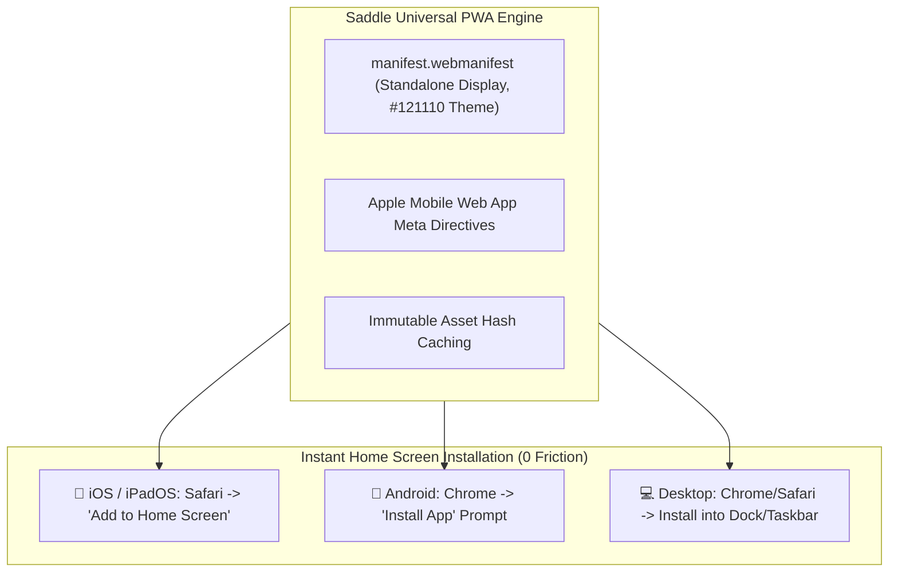

# Saddle Progressive Web App (PWA) & Universal Install Guide

> *"Trade your harness for a saddle."*

---

## 1. Executive Summary: Instant Native Install Without App Store Friction

Saddle is a **fully certified, production-grade Progressive Web App (PWA)**.

Any user on iPhone (Safari), Android (Chrome/Firefox), macOS (Safari/Chrome/Brave), or Windows can install Saddle directly onto their home screen or desktop dock with **one click**—achieving a native app window, custom titlebar, offline caching, and zero browser address bar clutter.



---

## 2. How PWA Installation Works Across All Operating Systems

### 1. iOS & iPadOS (iPhone / iPad)
* **How the user installs:**
  1. Open `http://91.99.165.95` (or `https://saddle.dev`) in Safari.
  2. Tap the **Share Button** (the box with the arrow).
  3. Scroll down and tap **"Add to Home Screen"**.
  4. Tap **"Add"**.
* **The Experience:**
  * Saddle appears on the iOS Home Screen with the official Saddle icon.
  * Launches as a standalone app without Safari URL bars or bottom navigation controls.
  * Utilizes `viewport-fit=cover` and `black-translucent` status bar for full-screen edge-to-edge aesthetics.

### 2. Android (Google Pixel, Samsung Galaxy, etc.)
* **How the user installs:**
  1. Open the URL in Google Chrome.
  2. A native banner appears: *"Add Saddle to Home screen"* (or tap Chrome Menu $	o$ *"Install App"*).
* **The Experience:**
  * Installs into the Android app drawer and home screen.
  * Runs in its own independent process in the Android multitasking app switcher.

### 3. macOS & Windows (Desktop Standalone)
* **How the user installs:**
  1. In Chrome / Brave / Edge: Click the **Install icon** in the right side of the address bar.
  2. In Safari (macOS Sonoma+): Click **File $	o$ Add to Dock**.
* **The Experience:**
  * Runs in a dedicated native desktop window with a custom dark `#121110` titlebar.
  * Can be pinned to the macOS Dock or Windows Taskbar.

---

## 3. PWA vs. Native App Store: The Two-Pronged Distribution Strategy

| Feature | Saddle PWA (Live Today) | Native App Store (Sprint 4–5) |
| :--- | :--- | :--- |
| **Installation Speed** | Instant (1 tap from browser) | Requires App Store search & 50MB download |
| **Update Velocity** | Instant (Server deploys reflect immediately) | Requires 24–48hr Apple review cycle |
| **Apple/Google Tax** | **0% Platform Cut** (Stripe Billing only) | 15% / 30% on direct in-app consumable purchases |
| **Hardware Access** | Standard Web APIs, WebAudio, WebGL | Deep background audio, push notifications, FaceID |
| **Discoverability** | Viral web links (`saddle.link/xyz`) | Global App Store search algorithms |

---

## 4. Technical PWA Directives Configured in Codebase

### `apps/web/public/manifest.webmanifest`:
```json
{
  "id": "/",
  "name": "Saddle | The Autonomous AI OS",
  "short_name": "Saddle",
  "start_url": "/",
  "scope": "/",
  "display": "standalone",
  "background_color": "#121110",
  "theme_color": "#121110",
  "icons": [
    {
      "src": "/favicon.svg",
      "sizes": "any",
      "type": "image/svg+xml",
      "purpose": "any"
    }
  ]
}
```

### `apps/web/index.html`:
```html
<meta name="viewport" content="width=device-width, initial-scale=1, viewport-fit=cover" />
<meta name="apple-mobile-web-app-capable" content="yes" />
<meta name="apple-mobile-web-app-status-bar-style" content="black-translucent" />
<meta name="apple-mobile-web-app-title" content="Saddle" />
<meta name="theme-color" content="#121110" />
<link rel="manifest" href="/manifest.webmanifest" />
```
