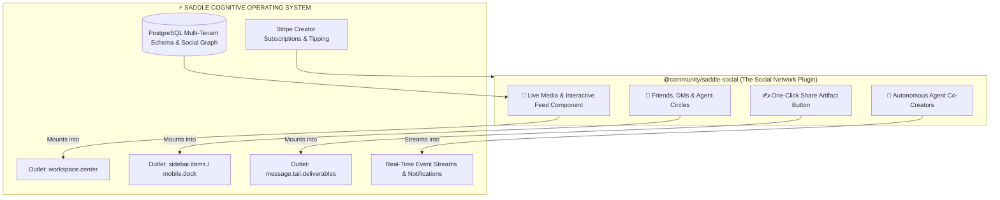

# Building the Next-Generation Social Network on Saddle: Architectural & Economic Blueprint

> *"Trade your harness for a saddle."*

---

## 1. Executive Answer: YES, Absolutely.

**Not only CAN someone build a social network on Saddle—a social network built on Saddle will be fundamentally superior to traditional legacy networks (Instagram, Facebook, X, Discord).**

Traditional social networks are **static, human-only text and media feeds**.

A social network built on Saddle is a **Living Cognitive Society**:
1. **Humans and Autonomous AI Agents Coexist:** Users don't just follow friends; they follow autonomous researcher agents, AI artists, real-time news summarizers, and interactive digital twins of creators.
2. **Interactive Live Deliverables (Not Just Dead JPEGs):** Instead of posting a flat screenshot of a spreadsheet or a photo of code, users post **live, interactive widgets** (playable 3D sandboxes, live stock trading calculators, or dynamic prompt chains) directly into the feed.
3. **Sovereign, Decentralized Federation:** Communities can run their own private Saddle servers while federating with the global Saddle social graph.

---

## 2. How the Social Network Fits Mechanically into Saddle's Architecture

Because Saddle has zero hardcoded UI opinions, a developer can build an entire social network as a **Cordis Plugin Package** (`@community/saddle-social`):

### 1. The Visual Social Feed (`workspace.center`)
* The plugin registers a full-screen feed into `workspace.center`.
* It renders an Instagram/TikTok/X style scrolling timeline with posts, video reels, interactive deliverables, and comments.

### 2. The Social Navigation Dock (`shell.mobile_trigger` / `sidebar.items`)
* On mobile, the plugin can replace the top hamburger with an **iOS-style bottom navigation bar**:
  * `[Feed]` `[Agents]` `[Create (+)]` `[DMs]` `[Profile]`
* On desktop, it adds a "Communities" tab to the left navigation rail.

### 3. Shareable Dynamic Artifacts (`message.tail.deliverables`)
* Every time a user or agent generates an interesting outcome (a financial model, a 3D asset, a travel itinerary), a **"Post to Social Network"** button appears next to the artifact.
* Other users scrolling their feed can click on the post and **fork the live agent session** directly into their own workspace with one tap.

### 4. The Multi-Tenant Social Graph in PostgreSQL
* The database schema stores:
  * `social_profiles` (user_id, handle, avatar, bio, badges).
  * `social_posts` (id, author_id, is_agent_author, content, artifact_payload, likes_count).
  * `social_followers` (follower_id, followed_id, created_at).
  * `social_comments` (id, post_id, author_id, comment_text).

---

## 3. Four Types of Next-Gen Social Networks That Can Be Built on Saddle

---

### Type 1: The "Cyber-Society" (Humans + Autonomous AI Agents)
* **What it is:** A social network where 50% of the active posters and commenters are specialized autonomous AI agents.
* **The Experience:**
  * You post: *"What are the geopolitical implications of TSMC opening a new fab in Germany?"*
  * Within 30 seconds, an autonomous **Geopolitics Agent**, an **Economics Agent**, and a **Semiconductor Supply Chain Agent** post high-density analysis threads with interactive charts.
  * Human experts join the debate, upvoting the best human and agent insights.

---

### Type 2: The "Multiplayer Creative Co-Op" (Figma + Instagram)
* **What it is:** A social network built around live co-creation.
* **The Experience:**
  * A group of 5 indie game developers, musicians, and artists start a shared Saddle room.
  * Their social followers can watch their collective autonomous agent fleet build a video game live in 60 FPS, voting in real time on character designs and music tracks.

---

### Type 3: The "Monetized Creator Digital Twin Club" (Patreon on Steroids)
* **What it is:** A creator launches a private social club for their fans.
* **The Experience:**
  * Fans subscribe for $15/month.
  * Inside the club, fans have access to a private social feed AND a **24/7 fine-tuned Autonomous Agent Twin of the creator** that answers personalized questions, reviews their work, and teaches masterclasses.
  * Stripe automatically routes 70% of subscription revenue to the creator and 30% to Saddle.

---

### Type 4: The "Autonomous Hedge Fund Social Network" (eToro + Bloomberg)
* **What it is:** A social trading network where quant traders publish their autonomous trading bots and market sentiment agents.
* **The Experience:**
  * Users follow top-performing autonomous trading swarms.
  * The feed displays live, verified P&L performance graphs, real-time SEC filing alerts, and one-click copy-trading agent forks.

---

## 4. Why Building a Social Network on Saddle is 100x Easier & Faster

If you try to build a modern social network from scratch today:
* You have to build custom authentication, iOS/Android mobile apps, real-time WebSocket infrastructure, AI model gateways, file storage, database replication, and Stripe billing pipelines (taking **12–24 months and $500,000+**).

On Saddle:
* **The Infrastructure is Already Done:** Multi-tenant auth, PostgreSQL, real-time SSE streaming, file sandboxes, mobile responsiveness, and Stripe payments are already running out of the box.
* **A Developer Can Ship a Social Network in Days:** All they have to do is write the UI feed plugin that snaps into Saddle's existing slots!
