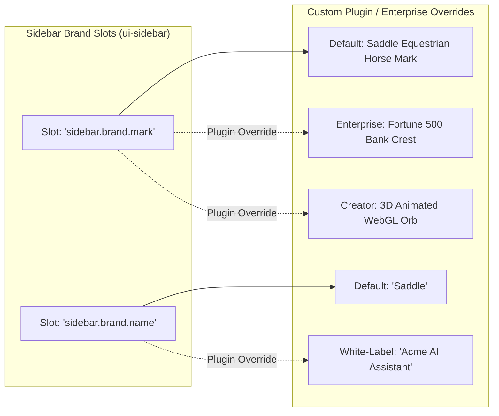

# Total Interface Replacement & White-Labeling in Saddle: The Zero Walled Garden Blueprint

> *"Trade your harness for a saddle."*

---

## 1. Executive Answer: Can Users & Enterprises Totally Redesign Everything?

### **YES, 100%—From the Brand Logo to the Root Screen.**

In Saddle, no single visual component is locked or permanent. Users, enterprise white-label clients, and third-party marketplace creators can completely replace:
1. **The Brand Logo & Name (`sidebar.brand.mark` & `sidebar.brand.name`):** Swap the default mark with any custom animated SVG, company crest, or enterprise corporate emblem.
2. **The Settings Modal & Navigation (`sidebar.settings` & `settings.section`):** Replace the centered dialog with iOS slide-up bottom sheets, macOS fullscreen preferences, or floating Command+K palettes.
3. **The Navigation Sidebar (`sidebar`):** Replace the chat list with Discord server icon rails, Notion nested trees, or Instagram bottom docks.
4. **The Entire Root Screen (`root`):** Throw away the 3-column layout completely and replace it with a 2D spatial canvas (Figma style), a floating window OS (macOS/Windows style), or a mobile vertical swipe stream (TikTok style).

---

## 2. Changing the Brand Logo & Identity (White-Labeling)

In traditional software, changing the application logo requires hacking source code or paying millions for custom enterprise forks.

In Saddle, **the logo and brand name are dedicated first-class slots**:



### How a Plugin Swaps the Logo at Runtime:
```typescript
import { Service } from '@deepseek-ai/cordis'

export class CustomEnterpriseBrandPlugin extends Service {
  static inject = ['slots']

  [Service.init]() {
    // 1. Replace the Brand Logo Mark
    this.ctx.slots.provide('sidebar.brand.mark', {
      priority: 200, // Overrides default mark
      component: ({ size }) => (
        
      ),
    })

    // 2. Replace the Brand Name
    this.ctx.slots.provide('sidebar.brand.name', {
      priority: 200,
      component: () => <span style={{ fontWeight: 800, color: '#f59e0b' }}>ACME CORP AI</span>,
    })
  }
}
```

---

## 3. The 3 Levels of Total Interface Redesign

```
┌────────────────────────────────────────────────────────────────────────────┐
│         LEVEL 3: TOTAL ROOT REPLACEMENT (Slot: 'root')                     │
│  • Replace AppFrame entirely w/ 2D Spatial Canvas or Windowed OS           │
└─────────────────────────────────────┬──────────────────────────────────────┘
                                      │
┌─────────────────────────────────────▼──────────────────────────────────────┐
│         LEVEL 2: MAJOR STRUCTURAL REPLACEMENT                              │
│  • Slot 'sidebar': Discord Icon Rail / Instagram Bottom Tabs               │
│  • Slot 'sidebar.settings': Slide-Up Sheets / Command+K Quick Settings     │
│  • Slot 'conversation': Jupyter Notebook / 3D CAD Viewport                 │
└─────────────────────────────────────┬──────────────────────────────────────┘
                                      │
┌─────────────────────────────────────▼──────────────────────────────────────┐
│         LEVEL 1: GRANULAR SLOTS & BRAND IDENTITY                           │
│  • Slot 'sidebar.brand.mark': Custom Logos & Animated Icons                │
│  • Slot 'shell.mobile_trigger': Custom Mobile Badges / Voice Triggers      │
│  • Slot 'settings.section': Domain Settings (Crypto, Health, Enterprise)  │
└────────────────────────────────────────────────────────────────────────────┘
```

---

## 4. Replacing the Settings Experience (`sidebar.settings`)

If an enterprise or mobile theme dislikes centered modal dialogs:
* A plugin simply registers into `sidebar.settings` with higher priority.
* The default dialog unmounts, and the new component (e.g. an iOS slide-up bottom sheet or Spotlight bar) mounts instantly.
* All registered settings sections (`Models`, `Presets`, `Plugins`, `Billing`) are automatically passed to the new component via the slot framework so no settings capabilities are lost.

---

## 5. Replacing the Entire Root Layout (`root`)

The browser shell renders only **one built-in slot: `'root'`**. The shipped 3-column layout (`AppFrame`) is **itself just a plugin registered into `'root'`**.

To build a totally new spatial paradigm (like a Figma-style canvas or Windows 95 desktop):
```typescript
import { Service } from '@deepseek-ai/cordis'
import { SpatialWhiteboardOS } from './SpatialWhiteboardOS.tsx'

export class SpatialLayoutPlugin extends Service {
  static inject = ['slots']

  [Service.init]() {
    // Replaces the entire 3-column AppFrame across the whole screen!
    this.ctx.slots.register({
      name: 'root',
      children: {
        'whiteboard.nodes': { kind: 'list', scope: 'root' },
      },
    }, SpatialWhiteboardOS)
  }
}
```

---

## Summary: Zero Walled Gardens

In traditional software (ChatGPT, VS Code, Instagram), you are trapped in the vendor's rigid UI box.

In Saddle, the entire interface is an empty reactive stage. You, your users, and third-party marketplace creators have 100% freedom to completely reinvent how humans and AI interact.
