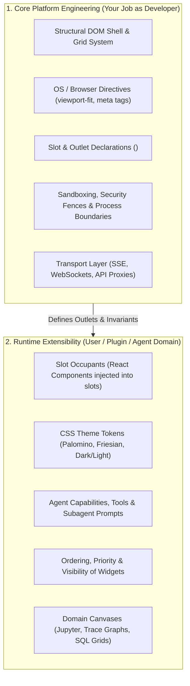

# Saddle Architecture Guide: Runtime UI Extensibility vs. Core Codebase Engineering

## 1. Executive Overview: Where Does Extensibility End and Core Development Begin?

A common question in extensible, modular architectures like Saddle is:
> *"If the UI is completely composable and users/plugins can change the interface at runtime, what are the limits? And why did our earlier fixes (like mobile Safe Area insets and hamburger alignment) require changing the actual codebase?"*

To understand this, we must establish the **First-Principles Separation of Concerns**:



---

## 2. What Are the Theoretical and Practical Limits of Runtime UI Customization?

### What Users, Plugins, and Agents **CAN** Do in Real Time (Without Codebase Changes):
1. **Replace Entire Workspace Views:**
   * A plugin can unmount the standard chat column and mount a 3D WebGL viewport, a spatial node canvas, or a full spreadsheet.
2. **Inject New Controls, Buttons, and Menu Items:**
   * Add custom buttons to `input.dock`, `chat.message.actions`, `app.header`, or `sidebar.items`.
3. **Change Themes, Typography, and Visual Styling:**
   * Override CSS variables (`--dsw-alias-bg-base`, `--dsw-alias-text-p1`, font-families, border-radii, accent colors).
4. **Attach Custom Heads-Up Displays (HUDs):**
   * Mount floating token meters, live latency charts, or multi-model comparators.
5. **Reorder and Prioritize Elements:**
   * Using the `priority` integer in `ctx.slots.provide(slotName, { priority: 100, component })`, higher-priority components take precedence or swap places.

---

### What Users and Plugins **CANNOT** Do at Runtime (The Hard Boundaries / Limits):

There are three inviolable boundaries where runtime plugins cannot act:

#### Boundary 1: The Browser Engine & HTML Document Primitives
* **Example:** The `<meta name="viewport" content="viewport-fit=cover">` tag in `index.html`.
* **Why:** iOS WebKit parses `viewport-fit` before any JavaScript or React code even downloads. If the HTML host document does not declare `viewport-fit=cover`, iOS simply returns `0px` for `env(safe-area-inset-top)`. A plugin loaded in JavaScript inside the DOM cannot retroactively change how the browser engine calculates the hardware viewport.

#### Boundary 2: Undefined or Missing Slots
* **Example:** If a plugin wants to inject a status bar widget between the sidebar and the main chat, but the core `AppFrame.tsx` does not have a `<SlotOutlet name="app.statusbar" />` rendered there, the plugin has nowhere to mount.
* **The Rule:** You cannot mount into a void. The Core Developer must define the **Outlets (the anchors)** before plugins can occupy them.

#### Boundary 3: Core Container Physics & Layout Geometry
* **Example:** If the root container `.panel` has `overflow: hidden; height: 100vh;` and an absolute `top: 0`, a child component inside a slot cannot break out of that bounding box to fix a clipping bug without distorting the layout.
* **Why Our Earlier Fix Was a Codebase Change:** The mobile settings modal was physically pinned to `top: 0` with inadequate safe-area padding in its base layout container. Fixing that required modifying the foundational CSS classes in `packages/client/ui-settings-general`.

---

## 3. The Decision Matrix: When Does a Change Require a Codebase Edit?

Use this decision matrix whenever evaluating whether a feature or fix belongs in the Core Codebase or a Runtime Plugin:

| Question | Codebase Change (Core Dev) | Plugin / User Config / Theme |
| :--- | :---: | :---: |
| Does it fix a baseline layout bug or clipping issue in the core frame? | ✅ **YES** | ❌ No |
| Does it require a new meta tag or browser-level directive (`index.html`)? | ✅ **YES** | ❌ No |
| Does it add a new named slot so other plugins can attach to it? | ✅ **YES** | ❌ No |
| Does it modify database schemas, auth tokens, or Docker network security? | ✅ **YES** | ❌ No |
| Does it add a new visual tool, button, or domain-specific dashboard? | ❌ No | ✅ **YES** |
| Does it customize colors, equestrian themes, or fonts? | ❌ No | ✅ **YES** |
| Does it create a new agent personality, prompt workflow, or tool? | ❌ No | ✅ **YES** |

---

## 4. The Exact Role and Mission of the Core Platform Developer

As the creator and lead engineer of Saddle, your mission is **not** to build every possible UI screen yourself. Your mission is to build the **High-Performance Cognitive Operating System**:

```
           ┌──────────────────────────────────────────────────┐
           │        ECOSYSTEM / USERS / COMMUNITY             │
           │  • Custom 3D Canvases  • Finance Trading HUDs    │
           │  • Domain Subagents    • Specialized Workflows   │
           └────────────────────────┬─────────────────────────┘
                                    │
                         Mounts into Outlets
                                    │
           ┌────────────────────────▼─────────────────────────┐
           │            YOUR JOB (THE CORE DEVELOPER)         │
           │  1. Bulletproof Core Shell & Mobile Geometry     │
           │  2. High-Capacity Slot Registry (ui-slots)       │
           │  3. Real-Time Event Engine (SSE / Projections)   │
           │  4. PostgreSQL Multi-Tenant Auth & Encrypted DB  │
           │  5. Sandboxed Micro-Jail Security (Landlock/Wasm)│
           │  6. Fast Bundling & Sub-10ms Hot Reloading       │
           └──────────────────────────────────────────────────┘
```

### Your Core Responsibilities:
1. **Architect the Geometry:** Ensure the root layout (`AppFrame`, modals, safe areas, responsive breakpoints) is indestructible across all devices (Desktop, iPad, iPhone, Android).
2. **Expose Rich Outlets:** Continuously audit the UI and ensure every strategic visual junction has a well-typed `<SlotOutlet />`.
3. **Guard Security & Performance:** Ensure plugins cannot block the main thread or leak cross-tenant data.
4. **Build the Monetization & Distribution Rails:** Build the Stripe billing hooks, developer marketplace submission pipeline, and tenant authentication so creators can build on top of Saddle.
