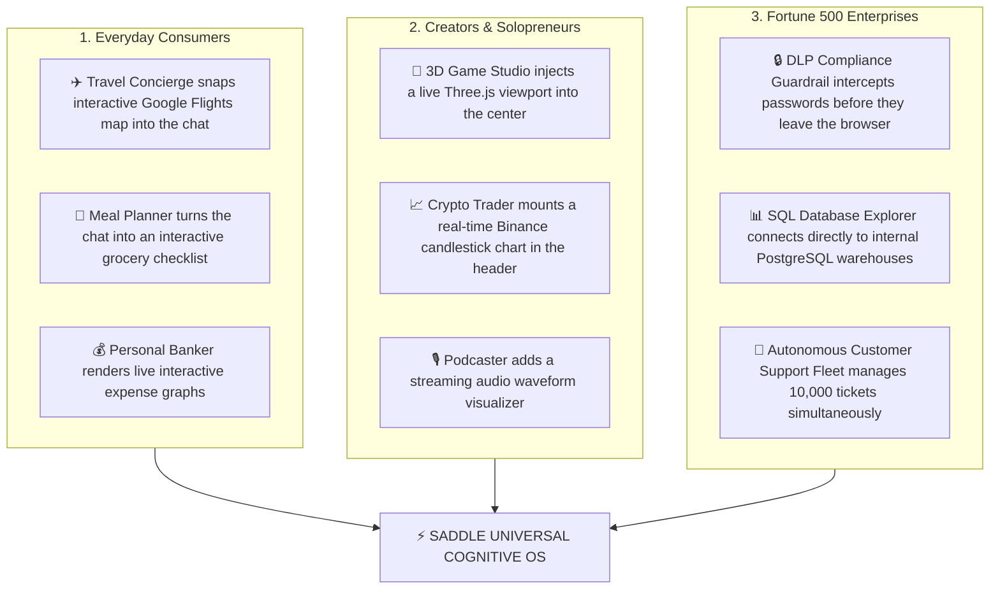

# The Saddle Masterclass: The Composable AI Paradigm Explained in Plain English

> *"Trade your harness for a saddle."*


---

## 1. The Core Metaphor: Concrete Walls vs. Magnetic Power Sockets

To understand why Saddle is a generational breakthrough, imagine two different houses:

### The Old Software Paradigm: The Concrete House (ChatGPT, Cursor, Instagram, VS Code)
Every app you have ever used in your life is like a house built out of **poured concrete**:
* The living room sofa is permanently cemented into the floor.
* The kitchen window is fixed in solid stone.
* If you want to move the TV to the patio or turn the bedroom into an art studio, **you cannot do it**. You have to call the original architect (the software vendor), beg them for a change, and wait months for them to demolish and rebuild the house (ship an app update).

### The Saddle Paradigm: The Magnetic Lego House (The Cognitive OS)
Saddle is built on a radical new philosophy: **Nothing is permanent. Everything is a dynamic socket.**
* The house has no fixed furniture. Instead, the walls, floors, and ceilings are covered in standardized, high-speed **Magnetic Power Sockets (called "Slots")**.
* If you want a TV, you snap a TV into a socket.
* If an AI agent wants to show you a financial chart, it snaps a live stock ticker into the wall.
* If you want to turn the whole room into a movie theater, the room unmounts the sofa and replaces it with stadium seating in 10 milliseconds.

---

## 2. Look at Your Screenshot: The DevTools Proof

Look closely at the Chrome DevTools tree on the right side of your screenshot:

```html
<div class="bR7R9W_frame">
  <div class="bR7R9W_mobileHamburger" title="Open Menu"></div>
  <div class="bR7R9W_sidebarCol"></div>
  <div class="bR7R9W_centerCol">
    <div data-slot="conversation">
      <div class="kBmzhq_root">
        <div data-slot="conversation.session.header"></div>
        <div class="kBmzhq_scrollBody"></div>
      </div>
    </div>
  </div>
  <div class="bR7R9W_detailsCol"></div>
  <div class="bR7R9W_overlayLayer" data-shell-overlay="true"></div>
</div>
```

Notice those attributes: **`data-slot="conversation"`**, **`data-slot="conversation.session.header"`**, **`data-shell-overlay="true"`**.

That is proof that **Saddle is not rendering hardcoded HTML**. Saddle is rendering an intelligent skeleton of **Slots (Outlets)**.

Every single visual component you see on the left—the sidebar, the plugin list, the model selector, the search bar, the chat turn—is an independent **Plugin** that plugged itself into one of those slots at runtime.

---

## 3. Are the Settings and Mobile Tabs Composable Too?

### **YES! 100% Composable.**

In your screenshot, you have the Settings modal open on the mobile preview, showing 4 tab icons at the top:
1. ⚙️ **General Settings** (from `@saddle/ui-settings-general`)
2. 🗄️ **Model Providers & Keys** (from `@saddle/ui-settings-models`)
3. 🎛️ **Agent Presets & Prompts** (from `@saddle/ui-settings-presets`)
4. 🧩 **Installed Plugins List** (from `@saddle/ui-settings-plugins`)

### How it works under the hood:
The Settings modal itself **does not know what tabs exist**. It simply declares an empty outlet:
```tsx
// Inside SettingsRoot.tsx
{renderSlot('settings.section', { close: onClose }, { only: activeId })}
```

When a new plugin boots up (e.g. an **Apple Health Tracker**, a **Shopify Store Manager**, or a **Crypto Wallet**), it tells Saddle:
> *"Hey, I have a settings page! Register me into `settings.section` with icon 💳 and order #5."*

Instantly:
* On **Desktop**, a new row appears in the Settings left sidebar.
* On **Mobile**, a 5th icon automatically slides into that top navigation bar in your screenshot.
* **Zero code in the core app was changed.**

---

## 4. What Can Users, Creators, and Businesses Actually Do?

Because the entire platform is composable, the possibilities are infinite:



### Real-World Scenarios in Plain English:

1. **The Consumer Scenario (Automated Flight Booking):**
   * You say: *"Find me the best weekend getaway to Tokyo under $1,200."*
   * In ChatGPT: It gives you a bulleted list of plain text links.
   * In Saddle: The `@saddle/flight-radar` plugin catches the agent's intent, unmounts the text chat, and snaps an **interactive 3D globe showing seat maps, flight routes, and a one-click checkout button** directly into your screen.
2. **The Creator Scenario (The 70/30 App Store):**
   * A developer in Tokyo builds a specialized Japanese language-learning tutor plugin.
   * They publish it to the Saddle Marketplace.
   * A student in London clicks **"Install"**. The plugin instantly mounts flashcard decks and pronunciation waveform analyzers into the student's Saddle interface.
   * Stripe automatically charges the student $10/mo, sending $7.00 to the developer and $3.00 to Saddle.
3. **The Executive Scenario (The 24/7 Automated Business):**
   * A solo entrepreneur connects their Stripe, GitHub, and Twitter accounts to Saddle.
   * Saddle's multi-agent swarm monitors server uptime, writes marketing tweets, fixes customer bug reports, and drafts invoices while the founder sleeps—with live telemetry cards showing revenue numbers in real time.

---

## 5. Summary: Why This Changes Everything

| Traditional Software (The Old World) | Saddle (The Composable World) |
| :--- | :--- |
| **Rigid:** One-size-fits-all interface hardcoded by engineers. | **Metamorphic:** The UI morphs in real time to fit whatever you are doing. |
| **Siloed:** You need 50 different apps on your phone (Slack, Excel, ChatGPT, Uber). | **Unified:** One Cognitive OS that loads lightweight capabilities on demand. |
| **Passive:** You click buttons to tell the computer what to do. | **Autonomous:** AI agents steer the interface and execute real-world tasks for you. |
| **Monopolistic:** Big Tech keeps 100% of the platform revenue. | **Democratic:** 70% of all marketplace plugin revenue goes directly to creators. |

**Saddle is not just a chatbot or a code editor—it is the universal canvas where human intent and autonomous intelligence converge.**
